# Portal 多集群架构设计文档

## 1. 系统架构概述

### 1.1 整体架构

Portal 作为中心化控制平面，管理多个 Waverless 集群，提供统一的用户入口、计费管理和智能调度能力。

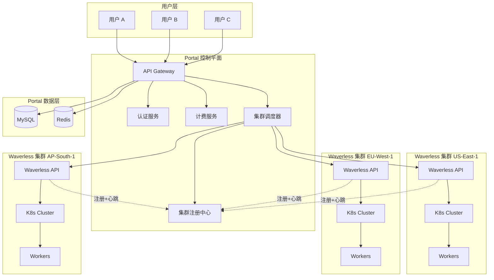

### 1.2 核心设计理念

1. **用户视角简化**：用户只需选择规格类型（GPU 或 CPU），无需关心具体集群
2. **智能调度**：Portal 自动选择最优集群（基于价格、可用性、区域）
3. **独立计费**：每个用户独立 endpoint，独立计费
4. **主动注册**：Waverless 主动向 Portal 注册能力和状态
5. **按时长计费**：按 Worker Pod 运行时长收费
6. **无本地用户表**：通过 JWT Cookie 从主站获取用户信息，无需维护本地用户数据

### 1.3 认证架构设计

Portal 采用**无本地用户表**设计，通过 JWT Cookie 与主站集成：

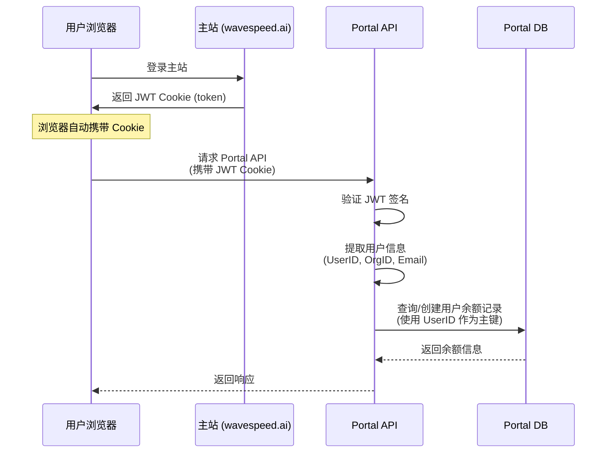

**关键设计点**：
- ✅ **无需注册登录**：用户在主站登录后，自动可以访问 Portal
- ✅ **统一身份管理**：用户信息统一由主站管理
- ✅ **简化维护**：Portal 无需处理密码、邮箱验证等逻辑
- ✅ **数据同步**：从 JWT 中提取用户信息，按需同步到 Portal（仅余额、偏好设置）

---

## 2. 数据库设计

### 2.1 Portal 数据库

#### 2.1.1 用户认证与余额管理

**认证方式**：不维护本地用户表，通过 JWT Cookie 从主站获取用户信息

```sql
-- 用户余额表（使用主站 user_id 作为主键）
CREATE TABLE user_balances (
    user_id VARCHAR(100) PRIMARY KEY,        -- 主站用户 UUID

    -- 余额信息
    balance DECIMAL(12, 4) NOT NULL DEFAULT 0,
    credit_limit DECIMAL(12, 4) DEFAULT 0,   -- 信用额度
    currency VARCHAR(10) DEFAULT 'USD',

    -- 状态
    status VARCHAR(50) DEFAULT 'active',     -- active, suspended, debt

    -- 预警阈值
    low_balance_threshold DECIMAL(12, 4) DEFAULT 10.00,

    -- 用户信息快照（从 JWT 同步，用于查询展示）
    org_id VARCHAR(100),
    user_name VARCHAR(255),
    email VARCHAR(255),

    -- 时间戳
    created_at TIMESTAMP DEFAULT CURRENT_TIMESTAMP,
    updated_at TIMESTAMP DEFAULT CURRENT_TIMESTAMP ON UPDATE CURRENT_TIMESTAMP,

    INDEX idx_org (org_id),
    INDEX idx_email (email)
) ENGINE=InnoDB DEFAULT CHARSET=utf8mb4 COMMENT='用户余额表';

-- 充值记录
CREATE TABLE recharge_records (
    id BIGINT PRIMARY KEY AUTO_INCREMENT,
    user_id VARCHAR(100) NOT NULL,           -- 主站用户 UUID

    -- 充值信息
    amount DECIMAL(12, 4) NOT NULL,
    currency VARCHAR(10) DEFAULT 'USD',

    -- 支付信息
    payment_method VARCHAR(50),              -- credit_card, paypal, stripe
    transaction_id VARCHAR(255),

    -- 状态
    status VARCHAR(50) DEFAULT 'pending',    -- pending, completed, failed, refunded

    -- 备注
    note TEXT,

    -- 时间戳
    created_at TIMESTAMP DEFAULT CURRENT_TIMESTAMP,
    completed_at TIMESTAMP,

    INDEX idx_user_recharge (user_id, created_at),
    INDEX idx_status (status)
) ENGINE=InnoDB DEFAULT CHARSET=utf8mb4 COMMENT='充值记录表';
```

#### 2.1.2 集群管理

```sql
-- 集群注册表
CREATE TABLE clusters (
    cluster_id VARCHAR(100) PRIMARY KEY,
    cluster_name VARCHAR(255) NOT NULL,

    -- 地理信息
    region VARCHAR(100) NOT NULL,            -- us, eu, ap
    location VARCHAR(255) NOT NULL,          -- us-east-1, eu-west-1

    -- 连接信息
    api_endpoint VARCHAR(500) NOT NULL,      -- http://waverless:8080
    api_key_hash VARCHAR(255),               -- Waverless API Key 哈希值

    -- 集群状态
    status VARCHAR(50) DEFAULT 'active',     -- active, maintenance, offline
    priority INT DEFAULT 100,                -- 调度优先级（越高越优先）

    -- 容量统计（从心跳更新）
    total_gpu_slots INT DEFAULT 0,
    available_gpu_slots INT DEFAULT 0,

    -- 注册信息
    first_registered_at TIMESTAMP,
    last_registered_at TIMESTAMP,
    last_heartbeat_at TIMESTAMP,

    -- 时间戳
    created_at TIMESTAMP DEFAULT CURRENT_TIMESTAMP,
    updated_at TIMESTAMP DEFAULT CURRENT_TIMESTAMP ON UPDATE CURRENT_TIMESTAMP,

    INDEX idx_region (region),
    INDEX idx_status (status),
    INDEX idx_heartbeat (last_heartbeat_at)
) ENGINE=InnoDB DEFAULT CHARSET=utf8mb4 COMMENT='集群注册表';

-- 集群规格表（支持 GPU 和 CPU）
CREATE TABLE cluster_specs (
    id BIGINT PRIMARY KEY AUTO_INCREMENT,
    cluster_id VARCHAR(100) NOT NULL,
    spec_name VARCHAR(100) NOT NULL,         -- GPU-A100-40GB 或 CPU-16C-32G (Waverless 中的 spec name)

    -- 规格类型
    spec_type VARCHAR(20) NOT NULL,          -- GPU, CPU

    -- 资源详细信息（从 Waverless 注册信息获取）
    gpu_type VARCHAR(100),                   -- A100-40GB (仅 GPU 规格)
    gpu_count INT DEFAULT 0,                 -- GPU 数量
    gpu_memory_gb INT,                       -- GPU 显存 (仅 GPU 规格)
    cpu_cores INT NOT NULL,                  -- CPU 核心数
    ram_gb INT NOT NULL,                     -- 内存大小
    disk_gb INT,                             -- 磁盘大小

    -- 容量信息（从 Waverless 上报）
    total_capacity INT DEFAULT 0,            -- 总节点数
    available_capacity INT DEFAULT 0,        -- 可用节点数
    in_use_capacity INT DEFAULT 0,           -- 使用中节点数

    -- 价格信息（Portal 维护，从 spec_pricing 表匹配）
    price_per_hour DECIMAL(10, 4),           -- 每小时价格
    currency VARCHAR(10) DEFAULT 'USD',

    -- 可用性
    is_available BOOLEAN DEFAULT true,

    -- 同步信息
    last_synced_at TIMESTAMP,
    created_at TIMESTAMP DEFAULT CURRENT_TIMESTAMP,
    updated_at TIMESTAMP DEFAULT CURRENT_TIMESTAMP ON UPDATE CURRENT_TIMESTAMP,

    UNIQUE KEY uk_cluster_spec (cluster_id, spec_name),
    FOREIGN KEY (cluster_id) REFERENCES clusters(cluster_id) ON DELETE CASCADE,
    INDEX idx_spec_type (spec_type),
    INDEX idx_gpu_type (gpu_type),
    INDEX idx_available (is_available, available_capacity),
    INDEX idx_price (price_per_hour)
) ENGINE=InnoDB DEFAULT CHARSET=utf8mb4 COMMENT='集群规格表（支持GPU和CPU）';
```

#### 2.1.3 价格管理

```sql
-- 规格价格配置表（支持 GPU 和 CPU 规格）
CREATE TABLE spec_pricing (
    id BIGINT PRIMARY KEY AUTO_INCREMENT,
    spec_name VARCHAR(100) NOT NULL UNIQUE,  -- GPU-A100-40GB, GPU-H100-80GB, CPU-16C-32G

    -- 规格类型
    spec_type VARCHAR(20) NOT NULL,          -- GPU, CPU

    -- 资源配置（用于展示和说明）
    gpu_type VARCHAR(100),                   -- A100-40GB, H100-80GB (仅 GPU 规格)
    gpu_count INT DEFAULT 0,                 -- GPU 数量
    cpu_cores INT NOT NULL,                  -- CPU 核心数
    ram_gb INT NOT NULL,                     -- 内存大小
    disk_gb INT,                             -- 磁盘大小

    -- 默认价格
    default_price_per_hour DECIMAL(10, 4) NOT NULL,
    currency VARCHAR(10) DEFAULT 'USD',

    -- 价格范围（可选）
    min_price DECIMAL(10, 4),
    max_price DECIMAL(10, 4),

    -- 描述
    description TEXT,

    -- 可用性
    is_available BOOLEAN DEFAULT true,

    -- 时间戳
    created_at TIMESTAMP DEFAULT CURRENT_TIMESTAMP,
    updated_at TIMESTAMP DEFAULT CURRENT_TIMESTAMP ON UPDATE CURRENT_TIMESTAMP,

    INDEX idx_spec_type (spec_type),
    INDEX idx_gpu_type (gpu_type),
    INDEX idx_available (is_available)
) ENGINE=InnoDB DEFAULT CHARSET=utf8mb4 COMMENT='规格价格配置表（支持GPU和CPU）';

-- 集群价格覆盖表（特殊定价）
CREATE TABLE cluster_pricing_overrides (
    id BIGINT PRIMARY KEY AUTO_INCREMENT,
    cluster_id VARCHAR(100) NOT NULL,
    spec_name VARCHAR(100) NOT NULL,         -- 改为 spec_name，支持 GPU 和 CPU

    -- 覆盖价格
    price_per_hour DECIMAL(10, 4) NOT NULL,
    currency VARCHAR(10) DEFAULT 'USD',

    -- 生效时间
    effective_from TIMESTAMP,
    effective_until TIMESTAMP,

    -- 原因
    reason VARCHAR(255),

    -- 时间戳
    created_at TIMESTAMP DEFAULT CURRENT_TIMESTAMP,
    updated_at TIMESTAMP DEFAULT CURRENT_TIMESTAMP ON UPDATE CURRENT_TIMESTAMP,

    UNIQUE KEY uk_cluster_spec (cluster_id, spec_name),
    FOREIGN KEY (cluster_id) REFERENCES clusters(cluster_id) ON DELETE CASCADE,
    INDEX idx_effective (effective_from, effective_until)
) ENGINE=InnoDB DEFAULT CHARSET=utf8mb4 COMMENT='集群特殊定价表';

-- 示例数据：
-- GPU 规格
INSERT INTO spec_pricing (spec_name, spec_type, gpu_type, gpu_count, cpu_cores, ram_gb, disk_gb, default_price_per_hour, description) VALUES
('GPU-A100-40GB', 'GPU', 'A100-40GB', 1, 16, 64, 200, 2.80, 'NVIDIA A100 40GB GPU'),
('GPU-H100-80GB', 'GPU', 'H100-80GB', 1, 32, 128, 500, 4.50, 'NVIDIA H100 80GB GPU'),
('GPU-A10-24GB', 'GPU', 'A10-24GB', 1, 8, 32, 100, 1.20, 'NVIDIA A10 24GB GPU');

-- CPU 规格
INSERT INTO spec_pricing (spec_name, spec_type, gpu_type, gpu_count, cpu_cores, ram_gb, disk_gb, default_price_per_hour, description) VALUES
('CPU-4C-8G', 'CPU', NULL, 0, 4, 8, 50, 0.10, '4 vCPU, 8GB RAM'),
('CPU-8C-16G', 'CPU', NULL, 0, 8, 16, 100, 0.20, '8 vCPU, 16GB RAM'),
('CPU-16C-32G', 'CPU', NULL, 0, 16, 32, 200, 0.40, '16 vCPU, 32GB RAM'),
('CPU-32C-64G', 'CPU', NULL, 0, 32, 64, 500, 0.80, '32 vCPU, 64GB RAM');
```

#### 2.1.4 Endpoint 管理

```sql
-- 用户 Endpoint 表
CREATE TABLE user_endpoints (
    id BIGINT PRIMARY KEY AUTO_INCREMENT,
    user_id VARCHAR(100) NOT NULL,           -- 主站用户 UUID
    org_id VARCHAR(100),                     -- 组织 ID

    -- Endpoint 名称
    logical_name VARCHAR(255) NOT NULL,      -- 用户看到的名字：my-model
    physical_name VARCHAR(255) NOT NULL,     -- Waverless 中的实际名字：user-{uuid}-my-model

    -- 规格信息（支持 GPU 和 CPU）
    spec_name VARCHAR(100) NOT NULL,         -- GPU-A100-40GB 或 CPU-16C-32G
    spec_type VARCHAR(20) NOT NULL,          -- GPU 或 CPU

    -- GPU 信息（仅 GPU 规格有值）
    gpu_type VARCHAR(100),                   -- A100-40GB（CPU 规格为 NULL）
    gpu_count INT DEFAULT 0,                 -- GPU 数量（CPU 规格为 0）

    -- 资源信息（所有规格都有）
    cpu_cores INT NOT NULL,                  -- CPU 核心数
    ram_gb INT NOT NULL,                     -- 内存大小

    -- 部署集群（Portal 自动选择）
    cluster_id VARCHAR(100) NOT NULL,

    -- 副本配置
    min_replicas INT NOT NULL,
    max_replicas INT NOT NULL,
    current_replicas INT DEFAULT 0,

    -- 镜像和配置
    image VARCHAR(500) NOT NULL,
    task_timeout INT DEFAULT 3600,
    env JSON,                                -- 环境变量

    -- 价格信息（创建时锁定）
    price_per_hour DECIMAL(10, 4),
    currency VARCHAR(10) DEFAULT 'USD',

    -- 调度偏好
    prefer_region VARCHAR(100),              -- 用户偏好区域

    -- 状态
    status VARCHAR(50) DEFAULT 'deploying',  -- deploying, running, suspended, deleted

    -- 时间戳
    created_at TIMESTAMP DEFAULT CURRENT_TIMESTAMP,
    updated_at TIMESTAMP DEFAULT CURRENT_TIMESTAMP ON UPDATE CURRENT_TIMESTAMP,
    deleted_at TIMESTAMP,

    UNIQUE KEY uk_user_endpoint (user_id, logical_name),
    FOREIGN KEY (cluster_id) REFERENCES clusters(cluster_id),
    INDEX idx_user (user_id),
    INDEX idx_org (org_id),
    INDEX idx_cluster (cluster_id),
    INDEX idx_spec_name (spec_name),
    INDEX idx_spec_type (spec_type),
    INDEX idx_status (status)
) ENGINE=InnoDB DEFAULT CHARSET=utf8mb4 COMMENT='用户Endpoint表（支持GPU和CPU规格）';
```

#### 2.1.5 计费管理

**设计原则**：
- ✅ **Worker 级计费**：按 Worker 实际运行时长计费（按秒计费）
- ✅ **单一数据源**：直接查询 Waverless `workers` 表获取运行时长
- ✅ **增量计费**：定期批量计费（每分钟），只计算 `last_billed_at` 到当前时间的增量
- ✅ **简化架构**：仅 2 张表（`billing_transactions` + `worker_billing_state`）

**数据流架构**：

```
Waverless 监控系统                          Portal 计费系统
┌─────────────────────┐                    ┌─────────────────────┐
│ workers             │──查询─→             │ worker_billing_state│
│ (Worker 生命周期)    │                    │ (计费状态追踪)      │
└─────────────────────┘                    └─────────────────────┘
                                                      ↓
                                           ┌─────────────────────┐
                                           │ billing_transactions│
                                           │ (计费流水)          │
                                           └─────────────────────┘
                                                      ↓
                                           ┌─────────────────────┐
                                           │ user_balances       │
                                           │ (扣费)              │
                                           └─────────────────────┘
```

```sql
-- 计费流水表（简化版）
CREATE TABLE billing_transactions (
    id BIGINT PRIMARY KEY AUTO_INCREMENT,

    -- 关联信息
    user_id VARCHAR(100) NOT NULL,           -- 主站用户 UUID
    org_id VARCHAR(100),                     -- 组织 ID
    endpoint_id BIGINT NOT NULL,             -- Portal Endpoint ID
    cluster_id VARCHAR(100) NOT NULL,        -- 集群 ID
    worker_id VARCHAR(255) NOT NULL,         -- Worker ID (Pod name)

    -- GPU 规格信息
    gpu_type VARCHAR(100) NOT NULL,          -- GPU 型号
    gpu_count INT NOT NULL,                  -- GPU 数量

    -- 计费周期
    billing_period_start TIMESTAMP NOT NULL, -- 计费开始时间（last_billed_at）
    billing_period_end TIMESTAMP NOT NULL,   -- 计费结束时间（pod_terminated_at 或 now）
    duration_seconds INT NOT NULL,           -- 本次计费时长（秒）

    -- 计费信息
    price_per_gpu_hour DECIMAL(10, 4) NOT NULL,  -- 单价（每 GPU 小时）
    gpu_hours DECIMAL(10, 4) NOT NULL,       -- GPU 小时数 = (duration_seconds / 3600) * gpu_count
    amount DECIMAL(12, 4) NOT NULL,          -- 本次扣费金额 = gpu_hours * price_per_gpu_hour
    currency VARCHAR(10) DEFAULT 'USD',

    -- 余额信息
    balance_before DECIMAL(12, 4),           -- 扣费前余额
    balance_after DECIMAL(12, 4),            -- 扣费后余额

    -- 扣费状态
    status VARCHAR(50) DEFAULT 'success',    -- success, failed, insufficient_balance
    error_message TEXT,

    -- 时间戳
    created_at TIMESTAMP DEFAULT CURRENT_TIMESTAMP,

    INDEX idx_user_billing (user_id, created_at),
    INDEX idx_org_billing (org_id, created_at),
    INDEX idx_endpoint_billing (endpoint_id, created_at),
    INDEX idx_worker_billing (worker_id, billing_period_start),
    INDEX idx_cluster_billing (cluster_id, created_at),
    FOREIGN KEY (endpoint_id) REFERENCES user_endpoints(id),
    FOREIGN KEY (cluster_id) REFERENCES clusters(cluster_id)
) ENGINE=InnoDB DEFAULT CHARSET=utf8mb4 COMMENT='计费流水表（Worker级别）';

-- Worker 计费状态表
CREATE TABLE worker_billing_state (
    worker_id VARCHAR(255) PRIMARY KEY,      -- Worker ID (Pod name)

    -- 关联信息
    user_id VARCHAR(100) NOT NULL,           -- 主站用户 UUID
    org_id VARCHAR(100),                     -- 组织 ID
    endpoint_id BIGINT NOT NULL,             -- Portal Endpoint ID
    cluster_id VARCHAR(100) NOT NULL,        -- 集群 ID

    -- GPU 规格信息（创建时从 Waverless 获取并锁定）
    gpu_type VARCHAR(100) NOT NULL,          -- GPU 型号
    gpu_count INT NOT NULL,                  -- GPU 数量
    price_per_gpu_hour DECIMAL(10, 4) NOT NULL,  -- 单价（创建时锁定）

    -- Worker 生命周期（从 Waverless 查询）
    pod_started_at TIMESTAMP NOT NULL,       -- Pod 启动时间（首次计费起点）
    pod_terminated_at TIMESTAMP,             -- Pod 终止时间（NULL 表示仍在运行）

    -- 计费状态
    last_billed_at TIMESTAMP NOT NULL,       -- 上次计费时间（初始值 = pod_started_at）
    total_billed_seconds INT DEFAULT 0,      -- 已计费总时长（秒）
    total_billed_amount DECIMAL(12, 4) DEFAULT 0,  -- 已扣费总金额
    billing_status VARCHAR(50) DEFAULT 'active',   -- active, terminated, final_billed

    -- 时间戳
    created_at TIMESTAMP DEFAULT CURRENT_TIMESTAMP,
    updated_at TIMESTAMP DEFAULT CURRENT_TIMESTAMP ON UPDATE CURRENT_TIMESTAMP,

    INDEX idx_user_worker (user_id),
    INDEX idx_org_worker (org_id),
    INDEX idx_endpoint (endpoint_id),
    INDEX idx_cluster (cluster_id),
    INDEX idx_billing_status (billing_status, last_billed_at),
    FOREIGN KEY (endpoint_id) REFERENCES user_endpoints(id),
    FOREIGN KEY (cluster_id) REFERENCES clusters(cluster_id)
) ENGINE=InnoDB DEFAULT CHARSET=utf8mb4 COMMENT='Worker计费状态追踪表';

-- 任务路由记录表（仅用于路由查询，不存储任务状态）
CREATE TABLE task_routing (
    id BIGINT PRIMARY KEY AUTO_INCREMENT,
    task_id VARCHAR(255) UNIQUE NOT NULL,
    user_id VARCHAR(100) NOT NULL,           -- 主站用户 UUID
    org_id VARCHAR(100),                     -- 组织 ID
    endpoint_id BIGINT NOT NULL,
    cluster_id VARCHAR(100) NOT NULL,        -- 任务路由到的集群

    -- 时间戳
    submitted_at TIMESTAMP DEFAULT CURRENT_TIMESTAMP,

    INDEX idx_task_id (task_id),             -- 快速查询任务路由到哪个集群
    INDEX idx_user_task (user_id, submitted_at),
    INDEX idx_org_task (org_id, submitted_at),
    INDEX idx_endpoint_task (endpoint_id, submitted_at),
    INDEX idx_cluster_task (cluster_id, submitted_at)
) ENGINE=InnoDB DEFAULT CHARSET=utf8mb4 COMMENT='任务路由记录表（仅路由信息，不含状态）';

-- 说明：
-- 1. 移除 status 和 completed_at 字段
-- 2. Portal 只记录"任务提交到哪个集群"
-- 3. 任务状态查询时，根据 task_id 找到 cluster_id，然后查询对应的 Waverless
-- 4. 避免状态同步问题，保持单一数据源（Waverless）
```

**计费逻辑（伪代码）**：

```go
// 定期批量计费任务（每分钟执行）
func BillingJob() {
    // 1. 查询所有活跃的 Worker 计费状态
    var workers []WorkerBillingState
    db.Where("billing_status = 'active'").Find(&workers)

    for _, worker := range workers {
        // 2. 查询 Waverless 获取 Worker 最新状态
        waverlessWorker := getWorkerFromWaverless(worker.ClusterID, worker.WorkerID)

        // 3. 确定计费结束时间
        var billingEnd time.Time
        if waverlessWorker.PodTerminatedAt != nil {
            // Worker 已终止，使用终止时间
            billingEnd = *waverlessWorker.PodTerminatedAt
        } else {
            // Worker 仍在运行，使用当前时间
            billingEnd = time.Now()
        }

        // 4. 计算增量计费时长
        durationSeconds := int(billingEnd.Sub(worker.LastBilledAt).Seconds())
        if durationSeconds <= 0 {
            continue  // 无需计费
        }

        // 5. 计算费用
        gpuHours := (float64(durationSeconds) / 3600.0) * float64(worker.GPUCount)
        amount := gpuHours * worker.PricePerGPUHour

        // 6. 查询用户余额
        var balance UserBalance
        db.Where("user_id = ?", worker.UserID).First(&balance)

        // 7. 检查余额
        if balance.Balance < amount {
            // 余额不足，记录失败流水，暂停 Endpoint
            recordFailedTransaction(worker, amount, "insufficient_balance")
            suspendEndpoint(worker.EndpointID)
            continue
        }

        // 8. 扣费
        balanceBefore := balance.Balance
        balance.Balance -= amount
        db.Save(&balance)

        // 9. 记录计费流水
        transaction := BillingTransaction{
            UserID:              worker.UserID,
            OrgID:               worker.OrgID,
            EndpointID:          worker.EndpointID,
            ClusterID:           worker.ClusterID,
            WorkerID:            worker.WorkerID,
            GPUType:             worker.GPUType,
            GPUCount:            worker.GPUCount,
            BillingPeriodStart:  worker.LastBilledAt,
            BillingPeriodEnd:    billingEnd,
            DurationSeconds:     durationSeconds,
            PricePerGPUHour:     worker.PricePerGPUHour,
            GPUHours:            gpuHours,
            Amount:              amount,
            BalanceBefore:       balanceBefore,
            BalanceAfter:        balance.Balance,
            Status:              "success",
        }
        db.Create(&transaction)

        // 10. 更新 Worker 计费状态
        worker.LastBilledAt = billingEnd
        worker.TotalBilledSeconds += durationSeconds
        worker.TotalBilledAmount += amount

        if waverlessWorker.PodTerminatedAt != nil {
            // Worker 已终止，标记为已完成最终计费
            worker.PodTerminatedAt = waverlessWorker.PodTerminatedAt
            worker.BillingStatus = "final_billed"
        }

        db.Save(&worker)
    }
}

// 当 Waverless 创建新 Worker 时调用（通过 Webhook）
func OnWorkerCreated(workerID, clusterID string) {
    // 1. 查询 Waverless 获取 Worker 详情
    waverlessWorker := getWorkerFromWaverless(clusterID, workerID)

    // 2. 查询 Endpoint 信息（获取价格）
    var endpoint UserEndpoint
    db.Where("physical_name = ? AND cluster_id = ?",
        waverlessWorker.Endpoint, clusterID).First(&endpoint)

    // 3. 创建计费状态记录
    billingState := WorkerBillingState{
        WorkerID:          workerID,
        UserID:            endpoint.UserID,
        OrgID:             endpoint.OrgID,
        EndpointID:        endpoint.ID,
        ClusterID:         clusterID,
        GPUType:           waverlessWorker.GPUType,
        GPUCount:          waverlessWorker.GPUCount,
        PricePerGPUHour:   endpoint.PricePerHour,  // 创建时锁定价格
        PodStartedAt:      waverlessWorker.PodStartedAt,
        LastBilledAt:      waverlessWorker.PodStartedAt,  // 初始值
        BillingStatus:     "active",
    }
    db.Create(&billingState)
}
```

**关键设计点**：

1. **Worker 级计费**：
   - 按 Worker 运行时长计费（按秒计费），不追踪任务级别
   - 计费公式：`duration_seconds * (gpu_count * price_per_gpu_hour / 3600)`

2. **增量计费**：
   - 定期批量计费（每分钟执行），只计算自 `last_billed_at` 以来的增量时长
   - 避免重复计费

3. **价格锁定**：
   - Worker 创建时锁定 `price_per_gpu_hour`，后续价格调整不影响已运行的 Worker

4. **即时最终计费**：
   - Worker 终止时，通过 webhook 立即触发最终计费
   - 计费到 `pod_terminated_at` 时间点，然后标记 `billing_status = 'final_billed'`

#### 2.1.6 用户偏好设置

```sql
-- 用户偏好设置表
CREATE TABLE user_preferences (
    user_id VARCHAR(100) PRIMARY KEY,        -- 主站用户 UUID

    -- 预算控制
    daily_budget_limit DECIMAL(12, 4),       -- 每日预算上限
    monthly_budget_limit DECIMAL(12, 4),     -- 每月预算上限

    -- 自动化设置
    auto_suspend_on_low_balance BOOLEAN DEFAULT true,  -- 余额不足时自动暂停
    auto_migrate_for_price BOOLEAN DEFAULT false,      -- 自动迁移到更便宜的集群

    -- 通知设置
    email_notifications BOOLEAN DEFAULT true,
    low_balance_alert BOOLEAN DEFAULT true,

    -- 时间戳
    created_at TIMESTAMP DEFAULT CURRENT_TIMESTAMP,
    updated_at TIMESTAMP DEFAULT CURRENT_TIMESTAMP ON UPDATE CURRENT_TIMESTAMP
) ENGINE=InnoDB DEFAULT CHARSET=utf8mb4 COMMENT='用户偏好设置表';
```

#### 2.1.7 监控数据获取（从 Waverless）

**设计原则**：Portal 不维护监控聚合表，所有监控数据直接从 Waverless 查询

**数据来源映射**：

| Portal 需求 | Waverless 数据源 | 说明 |
|------------|-----------------|------|
| **实时 Worker 状态** | `workers` 表 | 查询 status='Running' 的 Worker |
| **实时任务队列** | `tasks` 表 | 查询 status='PENDING' 的 Task |
| **分钟级监控** | `endpoint_minute_stats` | 最近 1-2 小时数据 |
| **小时级监控** | `endpoint_hourly_stats` | 最近 24 小时至 30 天数据 |
| **日级监控** | `endpoint_daily_stats` | 最近 90 天数据 |
| **Worker 资源使用** | `worker_resource_snapshots` | GPU/CPU 利用率，空闲时间 |
| **性能分析** | `tasks` 表 + 聚合计算 | 执行时长分布、P95/P99 |

**Portal API 实现策略**：

1. **用户查询监控数据时**：
   - Portal API 接收用户请求（带有 JWT 认证）
   - Portal 根据 `endpoint_name` 查询 `user_endpoints` 表，获取 `cluster_id` 和 `physical_name`
   - Portal 调用对应 Waverless 集群的内部 API，查询监控数据
   - Portal 将结果返回给用户（可选：添加计费相关字段）

2. **数据缓存策略**（可选）：
   - 实时数据：不缓存
   - 小时级数据：缓存 5 分钟
   - 日级数据：缓存 1 小时

3. **跨集群聚合**（多集群部署场景）：
   - 如果同一 Endpoint 部署在多个集群，Portal 聚合多个集群的数据
   - 目前 Phase 1 不支持多集群部署同一 Endpoint

---

### 2.2 Waverless 数据库

每个 Waverless 集群维护自己的 MySQL 数据库，存储本集群的运行数据。

#### 2.2.1 Worker 追踪表（新增）

**设计目的**：
- 记录 Worker Pod 的完整生命周期（用于与 Portal 对账）
- 追踪 Worker 执行的任务列表
- 提供问题排查和审计追踪能力

```sql
-- Worker 生命周期表
CREATE TABLE workers (
    id BIGINT PRIMARY KEY AUTO_INCREMENT,
    worker_id VARCHAR(255) NOT NULL UNIQUE,  -- Pod name (唯一标识)

    -- Worker 基本信息
    endpoint VARCHAR(255) NOT NULL,          -- 所属 endpoint（物理名称）
    spec_name VARCHAR(100) NOT NULL,         -- GPU 规格名称

    -- GPU 资源信息
    gpu_type VARCHAR(100) NOT NULL,          -- GPU 型号（如 A100-40GB）
    gpu_count INT NOT NULL,                  -- GPU 数量
    gpu_memory_gb INT,                       -- GPU 显存
    cpu_cores INT,                           -- CPU 核心数
    ram_gb INT,                              -- 内存大小

    -- 生命周期时间点
    pod_created_at TIMESTAMP NOT NULL,       -- Pod 创建时间
    pod_started_at TIMESTAMP,                -- Pod Running 开始时间（计费起点）
    pod_ready_at TIMESTAMP,                  -- Pod Ready 时间（可以接收任务）
    pod_terminated_at TIMESTAMP,             -- Pod 终止时间（计费终点）

    -- 运行状态
    status VARCHAR(50) NOT NULL,             -- Pending, Running, Completed, Failed, Terminating
    termination_reason VARCHAR(255),         -- 终止原因

    -- 统计信息
    tasks_completed INT DEFAULT 0,           -- 完成的任务数
    tasks_failed INT DEFAULT 0,              -- 失败的任务数
    total_execution_time_ms BIGINT DEFAULT 0, -- 总任务执行时长（毫秒）

    -- 同步信息
    synced_to_portal BOOLEAN DEFAULT false,  -- 是否已同步到 Portal
    portal_synced_at TIMESTAMP,              -- 同步到 Portal 的时间

    -- 时间戳
    created_at TIMESTAMP DEFAULT CURRENT_TIMESTAMP,
    updated_at TIMESTAMP DEFAULT CURRENT_TIMESTAMP ON UPDATE CURRENT_TIMESTAMP,

    INDEX idx_endpoint (endpoint),
    INDEX idx_status (status),
    INDEX idx_pod_started (pod_started_at),
    INDEX idx_pod_terminated (pod_terminated_at),
    INDEX idx_synced (synced_to_portal, portal_synced_at)
) ENGINE=InnoDB DEFAULT CHARSET=utf8mb4 COMMENT='Worker生命周期追踪表';

-- Worker 任务执行记录表
CREATE TABLE worker_task_executions (
    id BIGINT PRIMARY KEY AUTO_INCREMENT,
    worker_id VARCHAR(255) NOT NULL,         -- Worker Pod name
    task_id VARCHAR(255) NOT NULL,           -- Task ID

    -- 执行时间
    started_at TIMESTAMP NOT NULL,
    completed_at TIMESTAMP,
    duration_ms BIGINT,

    -- 执行结果
    status VARCHAR(50) NOT NULL,             -- IN_PROGRESS, COMPLETED, FAILED, TIMEOUT
    error TEXT,

    created_at TIMESTAMP DEFAULT CURRENT_TIMESTAMP,

    INDEX idx_worker (worker_id, started_at),
    INDEX idx_task (task_id),
    FOREIGN KEY (worker_id) REFERENCES workers(worker_id) ON DELETE CASCADE
) ENGINE=InnoDB DEFAULT CHARSET=utf8mb4 COMMENT='Worker任务执行记录表';
```

**关键设计点**：
- ✅ **完整生命周期追踪**：从 Pod 创建到终止的所有时间点
- ✅ **对账支持**：`synced_to_portal` 标记是否已同步到 Portal，用于对账
- ✅ **统计信息**：记录 Worker 执行的任务数和总时长
- ✅ **问题排查**：可以查询某个 Worker 执行了哪些任务

#### 2.2.2 现有 Tasks 表补充说明

```sql
-- Tasks 表（已存在，补充说明）
CREATE TABLE tasks (
    id BIGINT PRIMARY KEY AUTO_INCREMENT,
    task_id VARCHAR(255) NOT NULL UNIQUE,
    endpoint VARCHAR(255) NOT NULL,

    -- 任务输入输出
    input JSON NOT NULL,
    output JSON,
    error TEXT,

    -- 执行信息
    worker_id VARCHAR(255),                  -- 当前执行的 Worker
    status VARCHAR(50) NOT NULL,             -- PENDING, IN_PROGRESS, COMPLETED, FAILED

    -- 时间戳
    created_at TIMESTAMP DEFAULT CURRENT_TIMESTAMP,
    started_at TIMESTAMP,
    completed_at TIMESTAMP,

    -- 执行历史（JSON 数组，记录所有执行记录）
    extend JSON,                             -- [{worker_id, start_time, end_time, duration_ms}]

    INDEX idx_endpoint_status (endpoint, status),
    INDEX idx_worker_id (worker_id),
    INDEX idx_status (status),
    INDEX idx_created_at (created_at)
) ENGINE=InnoDB DEFAULT CHARSET=utf8mb4;
```

**Task 与 Worker 关系**：
- Task 的 `worker_id` 字段记录当前执行的 Worker
- Task 的 `extend` 字段记录所有执行历史（支持重试）
- Worker 的 `worker_task_executions` 表记录该 Worker 执行过的所有任务

---

## 3. 核心流程设计

### 3.1 Waverless 注册流程

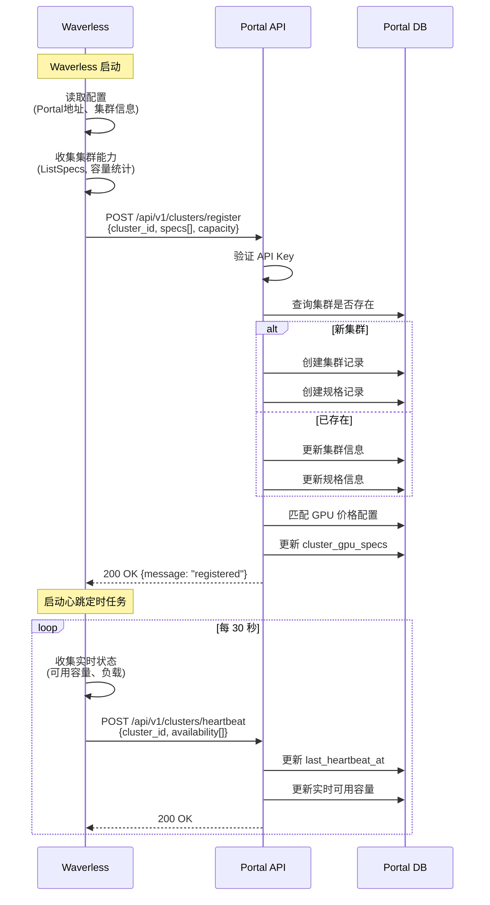

### 3.2 用户创建 Endpoint 流程

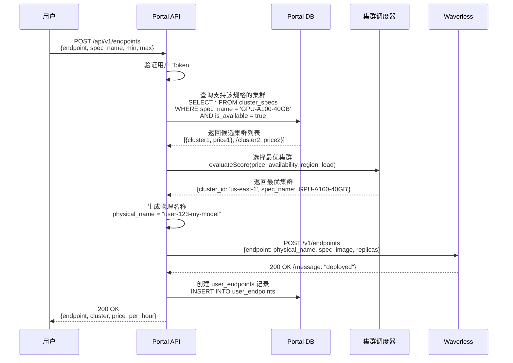

### 3.3 任务提交与结果查询流程

#### 3.3.1 任务提交

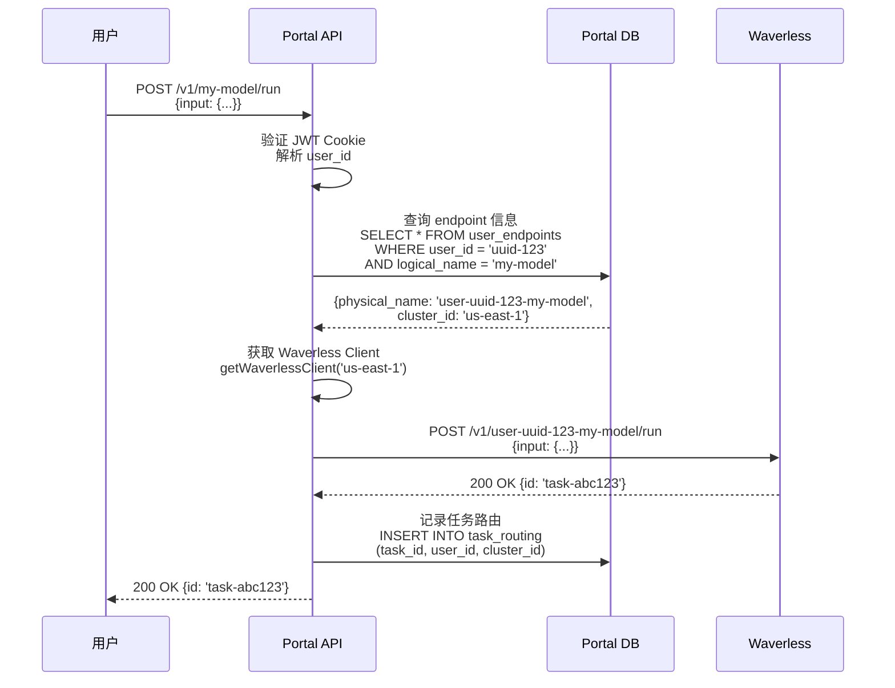

#### 3.3.2 任务状态与结果查询

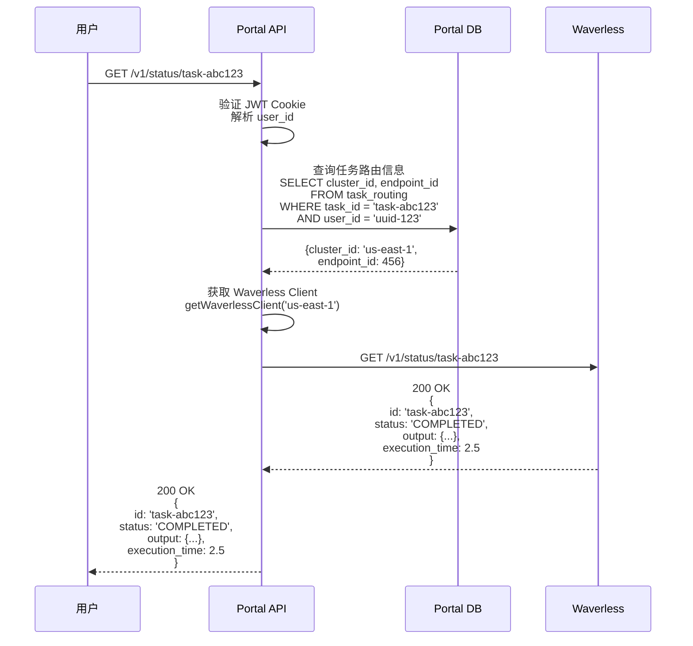

**关键设计点**：
- ✅ **任务结果存储在 Waverless**：每个 Waverless 集群的 MySQL 存储自己的任务数据
- ✅ **Portal 不缓存结果**：Portal 只记录路由信息，实时转发查询请求
- ✅ **权限验证**：Portal 验证 user_id 匹配，防止用户查询他人任务
- ✅ **跨集群透明**：用户无需知道任务在哪个集群，Portal 自动路由

### 3.4 Worker 计费流程

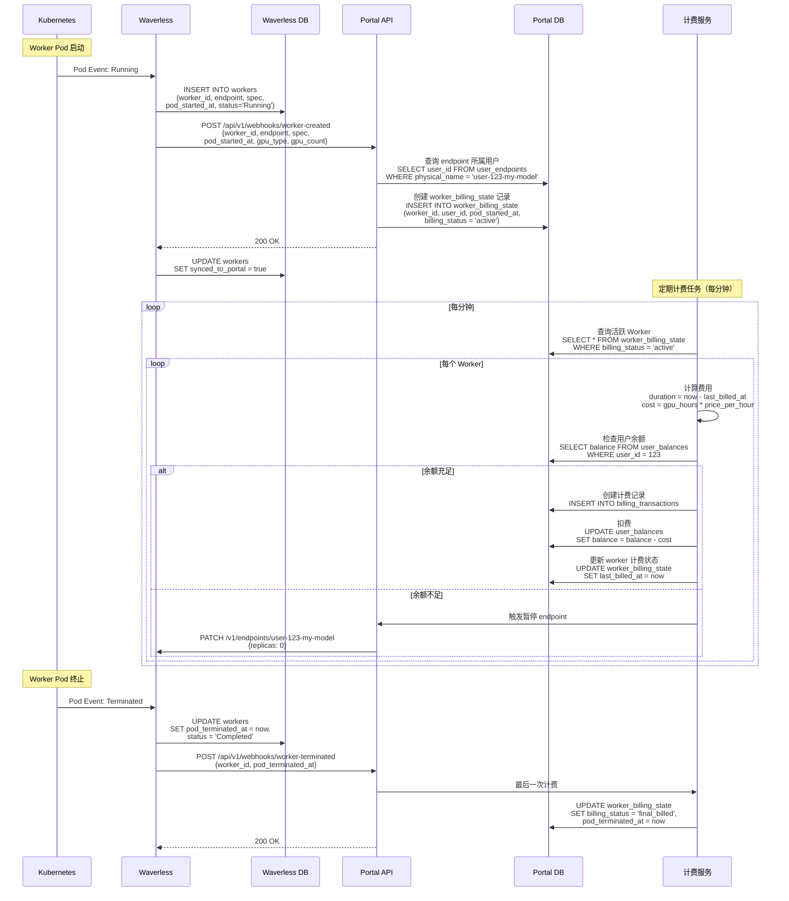

**关键设计点**：
- ✅ **双向记录**：Waverless 本地数据库和 Portal 数据库都记录 Worker 信息
- ✅ **对账支持**：Waverless 的 `synced_to_portal` 字段标记是否已同步
- ✅ **数据完整性**：Waverless 作为数据源，Portal 可以从 Waverless 拉取数据对账
- ✅ **生命周期追踪**：从 K8s Pod 事件到数据库记录的完整链路

### 3.5 集群选择算法流程

```mermaid
flowchart TD
    Start([用户创建 Endpoint]) --> A1[查询支持该规格的集群]

    A1 --> A2{是否有可用集群?}
    A2 -->|否| Error1[返回错误: 规格不可用]
    A2 -->|是| A3[获取候选集群列表]

    A3 --> B1[过滤: 容量不足的集群]
    B1 --> B2[过滤: 状态非 active 的集群]

    B2 --> C1{是否有候选集群?}
    C1 -->|否| Error2[返回错误: 容量不足]
    C1 -->|是| C2[开始评分]

    C2 --> D1[计算价格评分<br/>权重 40%]
    D1 --> D2[计算可用性评分<br/>权重 30%]
    D2 --> D3[计算区域偏好评分<br/>权重 20%]
    D3 --> D4[计算负载评分<br/>权重 10%]

    D4 --> E1[总分 = Σ(单项分数 × 权重)]

    E1 --> F1[按评分排序]
    F1 --> F2[选择评分最高的集群]

    F2 --> End([返回最优集群])

    style Start fill:#e1f5e1
    style End fill:#e1f5e1
    style Error1 fill:#ffe1e1
    style Error2 fill:#ffe1e1
```

### 3.6 价格评分计算

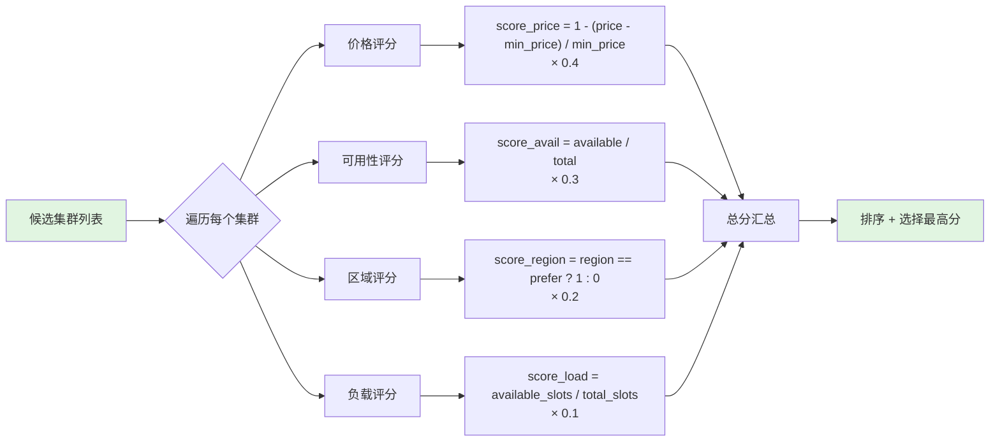

### 3.6 对账机制

Portal 和 Waverless 都记录 Worker 信息，需要定期对账确保数据一致性。

#### 3.6.1 对账数据源

**Waverless 侧（数据源）**：
```sql
SELECT
    worker_id,
    endpoint,
    spec_name,
    gpu_type,
    gpu_count,
    pod_created_at,
    pod_started_at,
    pod_ready_at,
    pod_terminated_at,
    tasks_completed,
    tasks_failed,
    total_execution_time_ms,
    cold_start_duration_ms,
    status,
    termination_reason,
    synced_to_portal
FROM workers
WHERE DATE(pod_started_at) = '2024-01-05'
```

**Portal 侧（同步缓存）**：
```sql
SELECT
    worker_id,
    user_id,
    endpoint_id,
    cluster_id,
    spec_name,
    gpu_type,
    gpu_count,
    pod_created_at,
    pod_started_at,
    pod_ready_at,
    pod_terminated_at,
    tasks_completed,
    tasks_failed,
    total_execution_time_ms,
    cold_start_duration_ms,
    total_billed_tasks,
    total_gpu_hours,
    total_cost,
    price_per_gpu_hour,
    status,
    termination_reason,
    reconciliation_status,
    last_synced_at
FROM worker_billing_state
WHERE DATE(pod_started_at) = '2024-01-05'
```

#### 3.6.2 对账流程

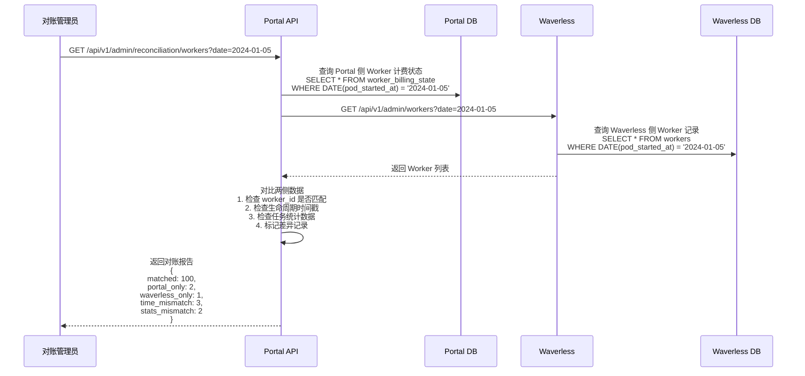

#### 3.6.3 对账差异类型

| 差异类型 | 说明 | 可能原因 | 处理方式 |
|---------|------|----------|---------|
| **Portal Only** | Portal 有缓存，Waverless 没有记录 | 1. Waverless webhook 发送成功但本地写入失败<br/>2. Waverless 数据被误删 | 标记为"需复核",人工确认 |
| **Waverless Only** | Waverless 有记录，Portal 没有缓存 | 1. Webhook 发送失败<br/>2. Portal 接收失败<br/>3. `synced_to_portal=false` | 重新同步到 Portal，补齐缓存数据 |
| **Time Mismatch** | 生命周期时间戳不一致 | 1. 时间戳精度问题<br/>2. 数据传输延迟<br/>3. 时区问题 | 以 Waverless 时间为准（数据源） |
| **Stats Mismatch** | 任务统计数据不一致 | 1. Worker 终止后新任务记录<br/>2. 统计聚合延迟<br/>3. 数据同步不完整 | 同步 Waverless 统计数据 |
| **Status Mismatch** | Worker 状态不一致 | 1. Termination webhook 丢失<br/>2. Portal 未正确更新状态 | 同步 Waverless 状态到 Portal |

#### 3.6.4 自动对账与修复

```go
// 对账定时任务（每天凌晨 2 点）
func ReconciliationCronJob() {
    yesterday := time.Now().AddDate(0, 0, -1)

    // 1. 从所有 Waverless 集群拉取 Worker 数据
    waverlessWorkers := fetchWorkersFromAllClusters(yesterday)

    // 2. 从 Portal DB 查询 Worker 数据
    portalWorkers := getPortalWorkers(yesterday)

    // 3. 对比数据
    diffs := compareWorkers(waverlessWorkers, portalWorkers)

    // 4. 自动修复
    for _, diff := range diffs {
        switch diff.Type {
        case "waverless_only":
            // Waverless 有但 Portal 没有，补齐 Portal 数据
            if !diff.WaverlessWorker.SyncedToPortal {
                syncWorkerToPortal(diff.WaverlessWorker)
                log.Info("补齐 Portal Worker 记录", "worker_id", diff.WorkerID)
            }

        case "time_mismatch":
            // 时间不一致，以 Waverless 为准
            updatePortalWorkerTime(diff.WorkerID, diff.WaverlessWorker.Times)
            log.Info("修复时间戳", "worker_id", diff.WorkerID)

        case "portal_only":
            // Portal 有但 Waverless 没有，标记为需人工复核
            markWorkerForReview(diff.WorkerID, "waverless_record_missing")
            log.Warn("发现异常记录，需人工复核", "worker_id", diff.WorkerID)
        }
    }

    // 5. 生成对账报告
    generateReconciliationReport(yesterday, diffs)
}
```

#### 3.6.5 对账报告示例

```json
{
  "date": "2024-01-05",
  "summary": {
    "total_workers": 1523,
    "matched": 1518,
    "portal_only": 2,
    "waverless_only": 3,
    "time_mismatch": 5,
    "auto_fixed": 8,
    "manual_review": 2
  },
  "details": [
    {
      "worker_id": "worker-abc-123",
      "type": "waverless_only",
      "action": "synced_to_portal",
      "cluster": "us-east-1",
      "endpoint": "user-uuid-my-model",
      "pod_started_at": "2024-01-05T10:30:00Z"
    },
    {
      "worker_id": "worker-def-456",
      "type": "portal_only",
      "action": "marked_for_review",
      "reason": "waverless_record_missing"
    }
  ]
}
```

**关键设计点**：
- ✅ **以 Waverless 为数据源**：对账时以 Waverless 的记录为准
- ✅ **自动修复**：大部分差异（如未同步、时间不一致）自动修复
- ✅ **人工复核**：异常情况（如 Portal Only）标记为需人工复核
- ✅ **可追溯**：对账报告记录所有差异和修复动作

### 3.7 监控数据查询流程

**设计原则**：Portal 不进行监控数据聚合，所有监控数据直接从 Waverless 查询。

#### 3.7.1 数据查询架构

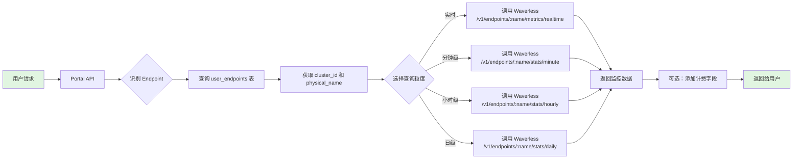

#### 3.7.2 Portal API 实现示例

**实时监控数据查询**：

```go
// GET /api/v1/endpoints/:endpoint/metrics
func (h *Handler) GetEndpointMetrics(c *gin.Context) {
    userID := c.GetString("user_id")
    logicalName := c.Param("endpoint")

    // 1. 查询 Endpoint 信息
    var endpoint models.UserEndpoint
    if err := h.db.Where("user_id = ? AND logical_name = ?", userID, logicalName).
        First(&endpoint).Error; err != nil {
        c.JSON(404, gin.H{"error": "endpoint not found"})
        return
    }

    // 2. 获取 Waverless 客户端
    waverlessClient := h.getWaverlessClient(endpoint.ClusterID)

    // 3. 查询实时监控数据
    metrics, err := waverlessClient.GetRealtimeMetrics(endpoint.PhysicalName)
    if err != nil {
        c.JSON(500, gin.H{"error": "failed to fetch metrics"})
        return
    }

    // 4. 可选：添加计费相关字段
    metrics.PricePerHour = endpoint.PricePerHour
    metrics.CurrentCostPerHour = float64(metrics.Workers.Total) * endpoint.PricePerHour

    // 5. 返回数据
    c.JSON(200, metrics)
}
```

**小时级趋势数据查询**：

```go
// GET /api/v1/endpoints/:endpoint/stats/hourly
func (h *Handler) GetEndpointHourlyStats(c *gin.Context) {
    userID := c.GetString("user_id")
    logicalName := c.Param("endpoint")
    from := c.Query("from")  // ISO 8601 时间戳
    to := c.Query("to")      // ISO 8601 时间戳

    // 1. 查询 Endpoint 信息
    var endpoint models.UserEndpoint
    if err := h.db.Where("user_id = ? AND logical_name = ?", userID, logicalName).
        First(&endpoint).Error; err != nil {
        c.JSON(404, gin.H{"error": "endpoint not found"})
        return
    }

    // 2. 获取 Waverless 客户端
    waverlessClient := h.getWaverlessClient(endpoint.ClusterID)

    // 3. 查询小时级统计数据
    stats, err := waverlessClient.GetHourlyStats(endpoint.PhysicalName, from, to)
    if err != nil {
        c.JSON(500, gin.H{"error": "failed to fetch stats"})
        return
    }

    // 4. 可选：为每个时间点添加成本数据
    for i := range stats.Stats {
        stats.Stats[i].Cost = stats.Stats[i].AvgWorkers * endpoint.PricePerHour
    }

    // 5. 返回数据
    c.JSON(200, stats)
}
```

#### 3.7.3 数据缓存策略

为了减少对 Waverless 的查询压力，Portal 可以实现可选的缓存层：

```go
type MetricsCacheKey struct {
    Endpoint    string
    Granularity string  // "realtime", "minute", "hourly", "daily"
    TimeRange   string  // "from-to" hash
}

func (h *Handler) getCachedMetrics(key MetricsCacheKey) (interface{}, bool) {
    // 根据粒度设置缓存时长
    var ttl time.Duration
    switch key.Granularity {
    case "realtime":
        return nil, false  // 实时数据不缓存
    case "minute":
        ttl = 1 * time.Minute
    case "hourly":
        ttl = 5 * time.Minute
    case "daily":
        ttl = 1 * time.Hour
    }

    // 从 Redis 获取缓存
    cacheKey := fmt.Sprintf("metrics:%s:%s:%s", key.Endpoint, key.Granularity, key.TimeRange)
    cached, err := h.redis.Get(ctx, cacheKey).Result()
    if err == nil {
        var data interface{}
        json.Unmarshal([]byte(cached), &data)
        return data, true
    }

    return nil, false
}

func (h *Handler) setCachedMetrics(key MetricsCacheKey, data interface{}, ttl time.Duration) {
    cacheKey := fmt.Sprintf("metrics:%s:%s:%s", key.Endpoint, key.Granularity, key.TimeRange)
    jsonData, _ := json.Marshal(data)
    h.redis.Set(ctx, cacheKey, jsonData, ttl)
}
```

#### 3.7.4 多集群场景处理

如果同一 Endpoint 部署在多个集群（Phase 2），Portal 需要聚合多个集群的监控数据：

```go
func (h *Handler) getMultiClusterMetrics(endpointID int64) (*MetricsData, error) {
    // 1. 查询该 Endpoint 的所有集群部署
    var deployments []models.EndpointDeployment
    h.db.Where("endpoint_id = ? AND status = 'active'", endpointID).
        Find(&deployments)

    // 2. 并发查询所有集群的监控数据
    var wg sync.WaitGroup
    results := make(chan *MetricsData, len(deployments))

    for _, deploy := range deployments {
        wg.Add(1)
        go func(clusterID, physicalName string) {
            defer wg.Done()
            client := h.getWaverlessClient(clusterID)
            metrics, _ := client.GetRealtimeMetrics(physicalName)
            results <- metrics
        }(deploy.ClusterID, deploy.PhysicalName)
    }

    wg.Wait()
    close(results)

    // 3. 聚合所有集群的数据
    aggregated := &MetricsData{}
    for metrics := range results {
        aggregated.Workers.Total += metrics.Workers.Total
        aggregated.Workers.Active += metrics.Workers.Active
        aggregated.Workers.Idle += metrics.Workers.Idle
        aggregated.Tasks.InQueue += metrics.Tasks.InQueue
        aggregated.Tasks.Running += metrics.Tasks.Running
        // ... 聚合其他指标
    }

    return aggregated, nil
}
```

**关键设计点**：
- ✅ **零聚合逻辑**：Portal 不维护任何聚合表，完全依赖 Waverless
- ✅ **按需查询**：用户请求时才查询 Waverless，避免不必要的数据同步
- ✅ **智能缓存**：根据数据粒度设置不同的缓存时长
- ✅ **多集群支持**：Phase 2 可以并发查询多集群并聚合
- ✅ **添加计费信息**：Portal 在返回监控数据时附加成本字段

---

## 4. API 设计

### 4.1 Portal 对外 API（用户侧）

#### 4.1.1 认证方式

**JWT Cookie 认证**：
- Cookie 名称：根据环境变量 `ENV` 自动判断
  - 生产环境：`token`
  - 测试环境：`test_token`
- JWT Secret：环境变量 `JWT_SECRET`
- 用户信息从 JWT Claims 中提取：
  ```go
  type Claims struct {
      UserID      string   // 用户 UUID
      OrgID       string   // 组织 UUID
      UserName    string   // 用户名
      Email       string   // 邮箱
      Role        string   // 角色
      Permissions []string // 权限列表
  }
  ```

**API 认证流程**：
```go
// Middleware: JWTAuth
func JWTAuth(c *gin.Context) {
    // 1. 获取 Cookie 名称（根据环境）
    cookieName := getCookieName()  // "token" or "test_token"

    // 2. 从 Cookie 获取 JWT token
    jwtToken, err := c.Cookie(cookieName)
    if err != nil || jwtToken == "" {
        c.JSON(401, gin.H{"error": "unauthorized"})
        c.Abort()
        return
    }

    // 3. 验证 JWT token
    claims, err := jwt.ValidateToken(jwtToken)
    if err != nil {
        c.JSON(401, gin.H{"error": "invalid token"})
        c.Abort()
        return
    }

    // 4. 提取用户信息
    userID := claims.UserID     // UUID
    orgID := claims.OrgID       // UUID
    email := claims.Email
    userName := claims.UserName

    // 5. 存入上下文
    c.Set("user_id", userID)
    c.Set("org_id", orgID)
    c.Set("email", email)
    c.Set("user_name", userName)

    // 6. 可选：自动创建/更新用户余额记录
    ensureUserBalance(userID, orgID, userName, email)

    c.Next()
}
```

#### 4.1.2 规格查询（GPU 和 CPU）

```
GET    /api/v1/specs                # 查询所有可用规格（GPU + CPU）
GET    /api/v1/specs?type=GPU       # 仅查询 GPU 规格
GET    /api/v1/specs?type=CPU       # 仅查询 CPU 规格
GET    /api/v1/specs/:name          # 查询特定规格详情
POST   /api/v1/estimate-cost        # 估算成本
```

**响应示例（GET /api/v1/specs）**：
```json
{
  "specs": [
    {
      "spec_name": "GPU-A100-40GB",
      "spec_type": "GPU",
      "gpu_type": "A100-40GB",
      "gpu_count": 1,
      "cpu_cores": 16,
      "ram_gb": 64,
      "disk_gb": 200,
      "price_per_hour": 2.80,
      "currency": "USD",
      "description": "NVIDIA A100 40GB GPU",
      "available_clusters": 3,
      "total_capacity": 50,
      "available_capacity": 35
    },
    {
      "spec_name": "CPU-16C-32G",
      "spec_type": "CPU",
      "gpu_type": null,
      "gpu_count": 0,
      "cpu_cores": 16,
      "ram_gb": 32,
      "disk_gb": 200,
      "price_per_hour": 0.40,
      "currency": "USD",
      "description": "16 vCPU, 32GB RAM",
      "available_clusters": 5,
      "total_capacity": 200,
      "available_capacity": 150
    }
  ]
}
```

#### 4.1.3 Endpoint 管理

```
POST   /api/v1/endpoints            # 创建 Endpoint
GET    /api/v1/endpoints            # 列出用户的 Endpoints
GET    /api/v1/endpoints/:name      # 获取 Endpoint 详情
PUT    /api/v1/endpoints/:name      # 更新 Endpoint 配置
DELETE /api/v1/endpoints/:name      # 删除 Endpoint
GET    /api/v1/endpoints/:name/workers  # 获取 Worker 列表
```

#### 4.1.4 任务提交（RunPod 兼容）

```
POST   /v1/:endpoint/run            # 异步提交任务
POST   /v1/:endpoint/runsync        # 同步提交任务
GET    /v1/status/:task_id          # 查询任务状态
POST   /v1/cancel/:task_id          # 取消任务
```

#### 4.1.5 计费查询

```
GET    /api/v1/billing/balance      # 查询余额
GET    /api/v1/billing/usage        # 查询使用统计
GET    /api/v1/billing/workers      # 查询 Worker 费用明细
POST   /api/v1/billing/recharge     # 充值
GET    /api/v1/billing/records      # 充值记录
```

#### 4.1.6 Endpoint 统计与监控

**实时状态查询**：
```
GET    /api/v1/endpoints/:name/metrics         # 获取实时指标
```

**响应示例**：
```json
{
  "endpoint_name": "my-model",
  "realtime": {
    "current_workers": 5,
    "current_tasks": 12,
    "tasks_last_5min": 45,
    "avg_latency_ms": 125.5,
    "last_updated": "2024-01-05T10:30:00Z"
  }
}
```

**小时级趋势查询**：
```
GET    /api/v1/endpoints/:name/stats/hourly    # 获取小时级统计
```

**Query Parameters**：
- `from`: 开始时间（ISO 8601，默认 24 小时前）
- `to`: 结束时间（ISO 8601，默认现在）

**响应示例**：
```json
{
  "endpoint_name": "my-model",
  "time_range": {
    "from": "2024-01-04T10:00:00Z",
    "to": "2024-01-05T10:00:00Z"
  },
  "stats": [
    {
      "stat_hour": "2024-01-04T10:00:00Z",
      "avg_workers": 4.5,
      "max_workers": 8,
      "min_workers": 2,
      "total_tasks": 120,
      "completed_tasks": 115,
      "failed_tasks": 5,
      "avg_execution_time_sec": 2.3,
      "total_gpu_seconds": 16200,
      "total_cost": 4.50
    },
    // ... 更多小时数据
  ]
}
```

**日级趋势查询**：
```
GET    /api/v1/endpoints/:name/stats/daily     # 获取日级统计
```

**Query Parameters**：
- `from`: 开始日期（YYYY-MM-DD，默认 30 天前）
- `to`: 结束日期（YYYY-MM-DD，默认今天）

**响应示例**：
```json
{
  "endpoint_name": "my-model",
  "time_range": {
    "from": "2024-01-01",
    "to": "2024-01-05"
  },
  "stats": [
    {
      "stat_date": "2024-01-05",
      "avg_workers": 5.2,
      "max_workers": 12,
      "peak_hour": "14",
      "total_tasks": 2850,
      "completed_tasks": 2790,
      "failed_tasks": 60,
      "success_rate": 97.89,
      "avg_execution_time_sec": 2.1,
      "total_gpu_hours": 124.5,
      "total_cost": 34.65
    },
    // ... 更多天数据
  ]
}
```

**Worker 列表查询**：
```
GET    /api/v1/endpoints/:name/workers         # 获取当前 Worker 列表
```

**响应示例**：
```json
{
  "endpoint_name": "my-model",
  "workers": [
    {
      "worker_id": "worker-abc-123",
      "status": "Running",
      "pod_started_at": "2024-01-05T08:30:00Z",
      "tasks_completed": 15,
      "tasks_failed": 0,
      "uptime_hours": 2.5,
      "current_cost": 0.70
    }
  ]
}
```

**综合Dashboard数据**：
```
GET    /api/v1/endpoints/:name/dashboard       # 获取 Dashboard 数据
```

**响应示例**（包含实时+趋势+排行）：
```json
{
  "endpoint_name": "my-model",
  "summary": {
    "status": "running",
    "current_workers": 5,
    "current_replicas": 5,
    "min_replicas": 2,
    "max_replicas": 10,
    "gpu_type": "A100-40GB",
    "cluster": "us-east-1",
    "price_per_hour": 2.80,
    "created_at": "2024-01-01T00:00:00Z"
  },
  "realtime": {
    "current_tasks": 12,
    "tasks_last_5min": 45,
    "avg_latency_ms": 125.5,
    "last_updated": "2024-01-05T10:30:00Z"
  },
  "last_24h": {
    "total_tasks": 2850,
    "completed_tasks": 2790,
    "failed_tasks": 60,
    "success_rate": 97.89,
    "total_cost": 67.20,
    "avg_workers": 4.8
  },
  "last_30d": {
    "total_tasks": 85500,
    "total_cost": 2016.00,
    "total_gpu_hours": 720.0
  },
  "hourly_chart": [
    // 最近 24 小时数据（用于绘制趋势图）
  ]
}
```

**关键设计点**：
- ✅ **分级查询**：实时、小时、日三个级别
- ✅ **时间范围过滤**：支持自定义时间范围
- ✅ **聚合数据**：减少前端计算压力
- ✅ **Dashboard API**：一次请求获取所有展示数据

---

#### 4.2.1 集群注册

```
POST   /api/v1/clusters/register    # 集群注册
POST   /api/v1/clusters/heartbeat   # 集群心跳
```

**注册请求体**：
```json
{
  "cluster_id": "us-east-1",
  "cluster_name": "US East Cluster 1",
  "region": "us",
  "location": "us-east-1",
  "api_endpoint": "http://waverless-svc:8080",
  "specs": [
    {
      "spec_name": "GPU-A100-40GB",
      "spec_type": "GPU",
      "gpu_type": "A100-40GB",
      "gpu_count": 1,
      "gpu_memory_gb": 40,
      "cpu_cores": 16,
      "ram_gb": 64,
      "disk_gb": 200,
      "total_capacity": 10,
      "available_capacity": 7,
      "in_use_capacity": 3
    },
    {
      "spec_name": "CPU-16C-32G",
      "spec_type": "CPU",
      "gpu_type": null,
      "gpu_count": 0,
      "gpu_memory_gb": 0,
      "cpu_cores": 16,
      "ram_gb": 32,
      "disk_gb": 200,
      "total_capacity": 50,
      "available_capacity": 35,
      "in_use_capacity": 15
    }
  ],
  "status": "active",
  "timestamp": "2024-01-05T10:00:00Z"
}
```

**心跳请求体**：
```json
{
  "cluster_id": "us-east-1",
  "status": "active",
  "timestamp": "2024-01-05T10:30:00Z",
  "total_slots": 150,
  "available_slots": 100,
  "specs_availability": [
    {
      "spec_name": "GPU-A100-40GB",
      "spec_type": "GPU",
      "available_capacity": 7
    },
    {
      "spec_name": "GPU-H100-80GB",
      "spec_type": "GPU",
      "available_capacity": 3
    },
    {
      "spec_name": "CPU-16C-32G",
      "spec_type": "CPU",
      "available_capacity": 35
    }
  ]
}
```

#### 4.2.2 Worker 生命周期通知

```
POST   /api/v1/webhooks/worker-created     # Worker 创建通知
POST   /api/v1/webhooks/worker-terminated  # Worker 终止通知
```

### 4.3 Portal 管理 API（管理员侧）

```
# 价格管理
GET    /api/v1/admin/pricing                    # 查询所有价格配置（GPU + CPU）
PUT    /api/v1/admin/pricing/:spec_name         # 更新规格价格
POST   /api/v1/admin/pricing/cluster-override   # 设置集群特殊价格

# 集群管理
GET    /api/v1/admin/clusters                   # 查询所有集群
PUT    /api/v1/admin/clusters/:id/status        # 更新集群状态
GET    /api/v1/admin/clusters/:id/metrics       # 查询集群指标
GET    /api/v1/admin/clusters/:id/specs         # 查询集群支持的规格

# 用户管理
GET    /api/v1/admin/users                      # 查询所有用户
PUT    /api/v1/admin/users/:id/balance          # 调整用户余额
PUT    /api/v1/admin/users/:id/status           # 更新用户状态
```

---

## 5. 关键技术点

### 5.1 集群健康检查

Portal 定时任务（每分钟）检测集群健康状态：

- 超过 2 分钟未收到心跳 → 标记为 `offline`
- 集群恢复心跳 → 自动恢复为 `active`
- 离线集群不参与调度

### 5.2 计费定时任务

每小时执行一次，对所有活跃 Worker 计费：

1. 查询 `billing_status = 'active'` 的 Worker
2. 计算自 `last_billed_at` 以来的运行时长
3. 计算费用并扣除用户余额
4. 更新 `last_billed_at` 和计费记录
5. 余额不足时暂停用户 Endpoints

### 5.3 余额预警机制

- 余额低于阈值时发送邮件通知
- 余额为负时自动暂停所有 Endpoints
- 充值后自动恢复 Endpoints（可选）

### 5.4 Endpoint 监控图表展示建议

#### 5.4.1 Dashboard 总览页

```
┌──────────────────────────────────────────────────────────────────────┐
│ Endpoint: my-model                                 ⚪ Running         │
├──────────────────────────────────────────────────────────────────────┤
│ 实时指标（最近 5 分钟）                                                │
│ ┌─────────┬─────────┬─────────┬─────────┐                           │
│ │ Workers │ Tasks   │ Latency │ Cost/hr │                           │
│ │   5     │  12/45  │ 125ms   │ $14.00  │                           │
│ └─────────┴─────────┴─────────┴─────────┘                           │
├──────────────────────────────────────────────────────────────────────┤
│ 最近 24 小时                                                          │
│ ┌─────────┬─────────┬─────────┬─────────┐                           │
│ │ 总任务  │ 成功率  │ GPU时长 │ 总费用  │                           │
│ │ 2,850   │ 97.89%  │ 67.2h   │ $67.20  │                           │
│ └─────────┴─────────┴─────────┴─────────┘                           │
├──────────────────────────────────────────────────────────────────────┤
│ Worker 数量趋势（最近 24 小时）                                       │
│                                                                      │
│  10 ┤                             ╭──╮                              │
│   8 ┤                   ╭────╮   │  │                              │
│   6 ┤          ╭────────╯    ╰───╯  ╰──╮                          │
│   4 ┤    ╭─────╯                       ╰────╮                     │
│   2 ┤────╯                                  ╰────                 │
│   0 ┴────────────────────────────────────────────                 │
│      0h  4h  8h  12h 16h 20h 24h                                   │
├──────────────────────────────────────────────────────────────────────┤
│ 任务吞吐量（最近 24 小时）                                            │
│                                                                      │
│ 150 ┤                    ╭───╮                                      │
│ 120 ┤            ╭───╮  │   │    ╭──╮                              │
│  90 ┤    ╭───╮  │   │  │   │╭───╯  │                              │
│  60 ┤───╯   ╰──╯   ╰──╯   ╰╯      ╰───                          │
│  30 ┤                                                              │
│   0 ┴────────────────────────────────────────────                 │
│      0h  4h  8h  12h 16h 20h 24h                                   │
├──────────────────────────────────────────────────────────────────────┤
│ 费用趋势（最近 24 小时）                                              │
│                                                                      │
│ $5  ┤                          ╭─────╮                              │
│ $4  ┤                ╭─────────╯     ╰────╮                        │
│ $3  ┤        ╭───────╯                    ╰────╮                  │
│ $2  ┤    ╭───╯                                ╰───╮              │
│ $1  ┤────╯                                        ╰────          │
│ $0  ┴────────────────────────────────────────────────            │
│      0h  4h  8h  12h 16h 20h 24h                                   │
└──────────────────────────────────────────────────────────────────────┘
```

#### 5.4.2 核心图表类型

**1. Worker 数量趋势图（折线图）**
- **X 轴**：时间（小时/天）
- **Y 轴**：Worker 数量
- **数据来源**：`endpoint_hourly_stats.avg_workers`
- **展示粒度**：最近 24 小时用小时级数据，最近 30 天用日级数据
- **交互**：鼠标悬停显示具体数值

**2. 任务吞吐量图（柱状图）**
- **X 轴**：时间
- **Y 轴**：任务数
- **数据来源**：`endpoint_hourly_stats.total_tasks`
- **颜色**：成功（绿色）、失败（红色）堆叠显示
- **交互**：点击可查看该时段详细任务列表

**3. 费用趋势图（面积图）**
- **X 轴**：时间
- **Y 轴**：费用（美元）
- **数据来源**：`endpoint_hourly_stats.total_cost`
- **样式**：渐变填充
- **辅助线**：显示平均费用线

**4. 任务执行时长分布图（直方图）**
- **X 轴**：执行时长区间（0-1s, 1-2s, 2-5s, 5-10s, 10s+）
- **Y 轴**：任务数量
- **数据来源**：需要从 Waverless 拉取原始任务数据
- **展示**：P50, P95, P99 标记线

**5. Worker 列表（表格）**
- **列**：Worker ID、状态、启动时间、已执行任务数、运行时长、当前费用
- **排序**：支持按各列排序
- **操作**：查看日志、重启 Worker

#### 5.4.3 实时更新策略

```javascript
// 前端实时更新策略
class EndpointDashboard {
  constructor(endpointName) {
    this.endpointName = endpointName;
    this.updateInterval = null;
  }

  // 启动实时更新
  startRealtimeUpdate() {
    // 立即获取一次数据
    this.fetchRealtimeMetrics();

    // 每 5 秒更新一次实时指标
    this.updateInterval = setInterval(() => {
      this.fetchRealtimeMetrics();
    }, 5000);
  }

  // 获取实时指标
  async fetchRealtimeMetrics() {
    const data = await fetch(`/api/v1/endpoints/${this.endpointName}/metrics`);
    this.updateRealtimeCards(data.realtime);
  }

  // 获取趋势图数据（用户切换时间范围时调用）
  async fetchHourlyStats(from, to) {
    const data = await fetch(
      `/api/v1/endpoints/${this.endpointName}/stats/hourly?from=${from}&to=${to}`
    );
    this.renderCharts(data.stats);
  }

  // 停止实时更新
  stopRealtimeUpdate() {
    if (this.updateInterval) {
      clearInterval(this.updateInterval);
    }
  }
}
```

#### 5.4.4 图表库推荐

- **ECharts**：功能强大，适合复杂图表
- **Chart.js**：轻量级，适合简单图表
- **Recharts**：React 友好，声明式
- **ApexCharts**：现代化，开箱即用

#### 5.4.5 用户交互功能

- **时间范围选择器**：最近 1 小时、6 小时、24 小时、7 天、30 天
- **刷新按钮**：手动刷新数据
- **导出功能**：导出 CSV 格式的统计数据
- **告警设置**：Worker 数量异常、任务失败率过高时告警
- **对比视图**：对比不同时间段的数据

**关键设计点**：
- ✅ **实时性**：关键指标 5 秒刷新一次
- ✅ **性能优化**：使用聚合数据，避免前端计算
- ✅ **用户友好**：清晰的可视化，便于发现异常
- ✅ **移动适配**：响应式设计，支持移动端查看

### 5.5 价格锁定策略

用户创建 Endpoint 时，价格锁定在 `user_endpoints.price_per_hour`：

- **优点**：避免用户因价格波动产生计费纠纷
- **缺点**：用户无法享受降价

**可选方案**：允许用户手动选择是否跟随市场价格

### 5.5 多集群容灾

- Portal 检测集群离线后，自动将新任务路由到其他集群
- 已有的 Endpoint 不自动迁移（需用户手动操作）
- 提供迁移工具：复制 Endpoint 到其他集群

### 5.6 数据同步策略

**Waverless → Portal**：
- 注册：每 60 秒全量上报
- 心跳：每 30 秒增量上报

**Portal → Waverless**：
- 按需调用（创建/更新/删除 Endpoint）
- 不主动拉取数据

---

## 6. 部署架构

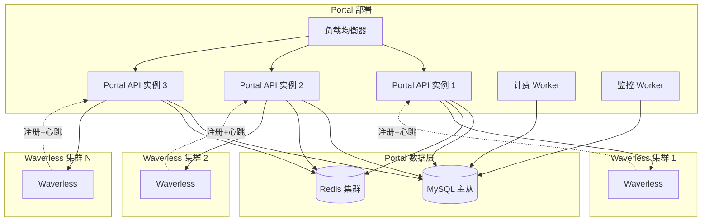

---

## 7. 性能指标

### 7.1 目标指标

- **API 响应时间**：P95 < 200ms
- **任务提交延迟**：< 100ms（Portal 转发）
- **集群选择时间**：< 50ms
- **计费精度**：误差 < 1%
- **集群健康检测延迟**：< 2 分钟
- **支持规模**：
  - 用户数：10,000+
  - 集群数：100+
  - 并发 Endpoint：50,000+
  - 并发 Worker：100,000+

### 7.2 数据库索引优化

**高频查询**：
- 用户查询 Endpoints：`idx_user_endpoint`
- 集群选择查询：`idx_spec_type`, `idx_spec_name`, `idx_available`
- 计费查询活跃 Worker：`idx_billing_status`
- 任务路由查询：`idx_user_task`, `idx_endpoint_task`

---

## 8. 配置与环境变量

### 8.1 必需环境变量

```bash
# JWT 配置
JWT_SECRET=your-jwt-secret-key           # JWT 签名密钥（必需）
ENV=production                           # 环境：production, test, development

# 主站配置（可选，默认根据 ENV 自动判断）
MAIN_SITE_URL=https://wavespeed.ai      # 主站地址
API_SITE_URL=https://api.wavespeed.ai   # API 地址

# 数据库配置
MYSQL_HOST=localhost
MYSQL_PORT=3306
MYSQL_USER=portal
MYSQL_PASSWORD=password
MYSQL_DATABASE=portal

REDIS_HOST=localhost
REDIS_PORT=6379
REDIS_PASSWORD=
```

### 8.2 Cookie 配置规则

| ENV 环境 | Cookie 名称 | 主站地址 | API 地址 |
|----------|-------------|----------|----------|
| production | `token` | https://wavespeed.ai | https://api.wavespeed.ai |
| test | `test_token` | https://tropical.wavespeed.ai | https://api-test.wavespeed.ai |
| development | `test_token` | http://localhost:3000 | http://localhost:8080 |

### 8.3 JWT Claims 结构

```json
{
  "user_id": "550e8400-e29b-41d4-a716-446655440000",
  "org_id": "660e8400-e29b-41d4-a716-446655440001",
  "user_name": "john_doe",
  "email": "john@example.com",
  "role": "user",
  "permissions": ["endpoint.create", "endpoint.delete"],
  "exp": 1704153600,
  "iat": 1704067200
}
```

---

## 9. 安全设计

### 9.1 认证机制

- **用户侧**：JWT Cookie 认证（从主站获取）
- **Waverless 侧**：API Key（预共享密钥）
- **管理员侧**：JWT + 管理员邮箱白名单

### 9.2 数据加密

- **传输加密**：HTTPS/TLS 1.3
- **JWT 验证**：使用 JWT_SECRET 验证签名
- **敏感字段**：API Key 存储哈希值（SHA-256）

### 9.3 访问控制

- 用户只能访问自己的 Endpoints 和计费数据（基于 JWT 中的 user_id）
- Waverless 只能注册自己的集群信息（基于 API Key）
- 管理员通过邮箱白名单识别（config.IsAdminEmail）

### 9.4 CORS 配置

```go
// 允许主站跨域访问
AllowOrigins: []string{
    "https://wavespeed.ai",
    "https://tropical.wavespeed.ai",
}
AllowCredentials: true  // 允许携带 Cookie
```

---

## 10. 监控与告警

### 10.1 监控指标

- **集群监控**：心跳延迟、离线时长、容量利用率
- **计费监控**：计费延迟、扣费失败率、余额不足用户数
- **API 监控**：QPS、延迟分布、错误率
- **数据库监控**：慢查询、连接数、主从延迟

### 10.2 告警规则

- 集群离线超过 5 分钟 → 发送告警
- 计费失败率超过 1% → 发送告警
- API 错误率超过 5% → 发送告警
- 数据库主从延迟超过 10 秒 → 发送告警

---

## 11. 未来扩展

### 11.1 多集群部署（Phase 2）

支持用户将一个 Endpoint 部署到多个集群，实现：
- 跨集群负载均衡
- 高可用容灾
- 就近路由（降低延迟）

### 11.2 动态定价（Phase 3）

根据供需关系动态调整价格：
- 高峰时段涨价
- 低谷时段降价
- 促销活动

### 11.3 资源预留（Phase 4）

支持用户预留 GPU 资源（类似 AWS Reserved Instances）：
- 长期承诺享受折扣
- 保证资源可用性

### 11.4 主站集成计费（Phase 5）

将 Portal 的计费系统与主站统一：
- 主站统一扣费（调用主站计费 API）
- Portal 只负责用量统计和上报
- 用户在主站查看统一账单

---

## 附录：术语表

| 术语 | 说明 |
|------|------|
| Portal | 中心化控制平面，管理多个 Waverless 集群 |
| Waverless | Serverless 任务调度系统（支持 GPU 和 CPU） |
| Endpoint | 用户部署的应用/模型，对应一个 Kubernetes Deployment |
| Logical Name | 用户看到的 Endpoint 名称（如 `my-model`） |
| Physical Name | Waverless 中的实际 Endpoint 名称（如 `user-123-my-model`） |
| Worker | 执行任务的 Pod（可以是 GPU 或 CPU） |
| Spec | 规格配置（如 `GPU-A100-40GB` 或 `CPU-16C-32G`） |
| Spec Name | 规格名称，唯一标识一种资源配置 |
| Spec Type | 规格类型（`GPU` 或 `CPU`） |
| GPU Type | GPU 型号（如 `A100-40GB`，仅 GPU 规格有值） |
| Cluster | Waverless 集群，包含一个 K8s 集群 |
| Region | 地理区域（如 `us`, `eu`, `ap`） |
| Location | 具体位置（如 `us-east-1`, `eu-west-1`） |
