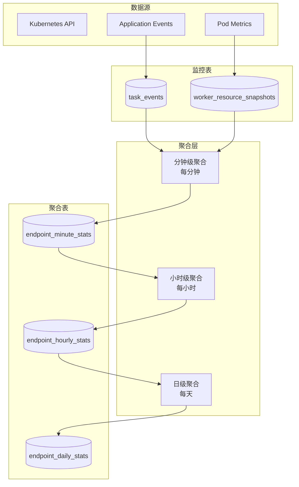
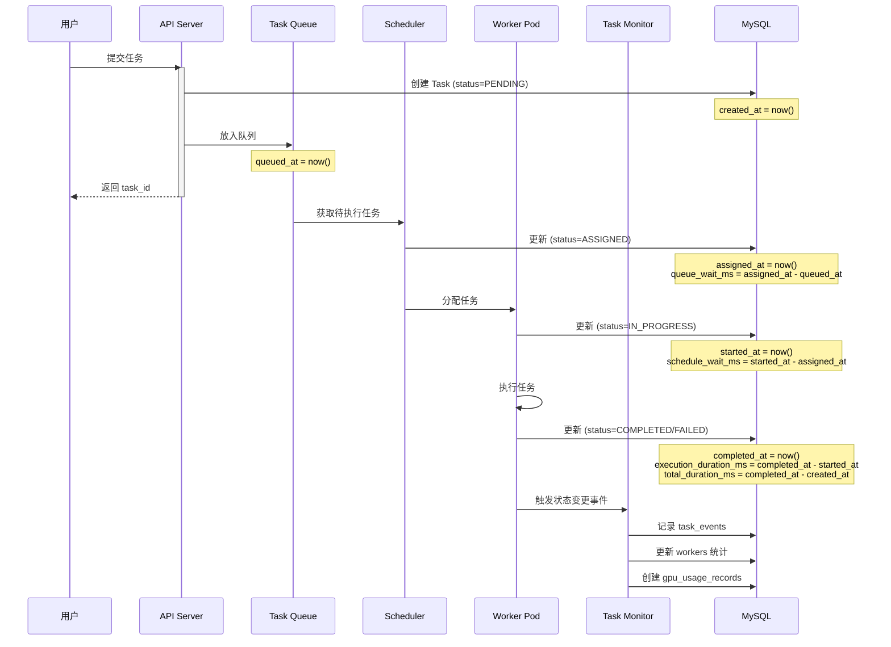
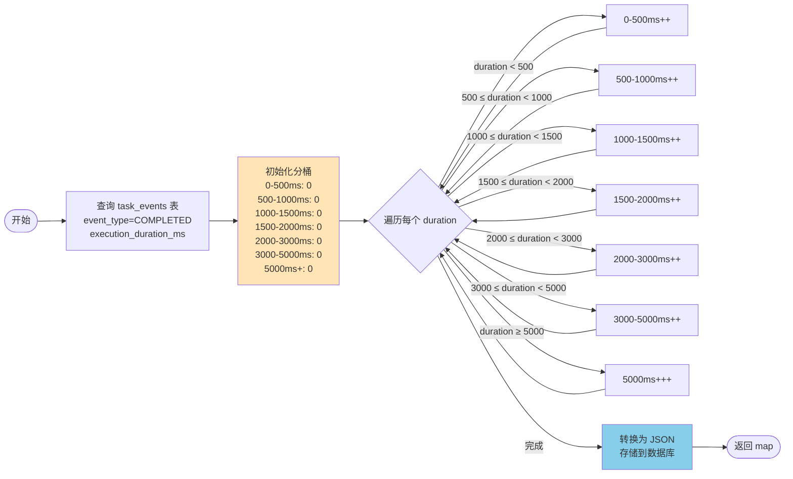
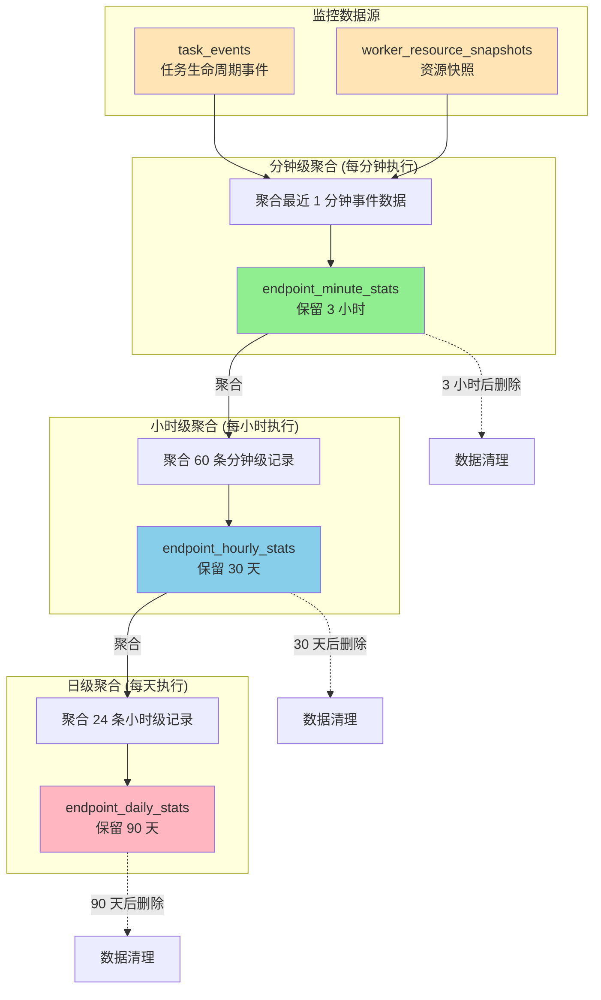

# Waverless 监控系统设计文档

## 1. 系统概述

### 1.1 设计目标

Waverless 作为 GPU Serverless 任务调度系统，需要完善的监控能力来：

- **实时监控**：实时掌握系统运行状态（Worker、Task、资源使用）
- **性能分析**：分析任务执行效率、延迟分布、瓶颈定位
- **容量规划**：了解资源使用趋势，指导扩缩容决策
- **问题排查**：快速定位故障、异常任务、性能问题
- **用户可见**：为用户提供 Endpoint 运行数据和性能指标

### 1.2 核心设计原则

| 原则 | 说明 |
|------|------|
| **简单优先** | 最小化表数量，复用已有业务表 |
| **分层聚合** | 原始事件 → 分钟级 → 小时级 → 日级，逐层聚合 |
| **事件驱动** | 任务状态变化时写入事件表 |

### 1.3 表结构总览

```
业务表（已有）：
├── tasks                        # 任务表
└── workers                      # Worker 表（含冷启动时长）

监控表（新增 4 个）：
├── task_events                  # 任务事件（核心）
├── worker_resource_snapshots    # 资源快照（每分钟）
├── endpoint_minute_stats        # 分钟级聚合
├── endpoint_hourly_stats        # 小时级聚合
└── endpoint_daily_stats         # 日级聚合
```

### 1.4 监控范围

```
┌─────────────────────────────────────────────────────────────┐
│                     Waverless 监控体系                       │
├─────────────────────────────────────────────────────────────┤
│                                                             │
│  ┌──────────────┐  ┌──────────────┐  ┌──────────────┐     │
│  │ Endpoint 监控 │  │  Worker 监控 │  │  Task 监控   │     │
│  ├──────────────┤  ├──────────────┤  ├──────────────┤     │
│  │ • 副本数     │  │ • 生命周期   │  │ • 任务状态   │     │
│  │ • 请求量     │  │ • 资源使用   │  │ • 执行时长   │     │
│  │ • 成功率     │  │ • 任务数     │  │ • 重试次数   │     │
│  │ • 延迟分布   │  │ • 冷启动     │  │ • 失败原因   │     │
│  └──────────────┘  └──────────────┘  └──────────────┘     │
│                                                             │
│  ┌──────────────┐  ┌──────────────┐  ┌──────────────┐     │
│  │ 集群资源监控 │  │  队列监控    │  │  系统监控    │     │
│  ├──────────────┤  ├──────────────┤  ├──────────────┤     │
│  │ • GPU 使用率 │  │ • 队列长度   │  │ • API 延迟   │     │
│  │ • 节点状态   │  │ • 等待时长   │  │ • 数据库性能 │     │
│  │ • 可用容量   │  │ • 积压任务   │  │ • 错误率     │     │
│  └──────────────┘  └──────────────┘  └──────────────┘     │
│                                                             │
└─────────────────────────────────────────────────────────────┘
```

---

## 2. 数据库设计

### 2.1 Worker 监控表

#### 2.1.1 Worker 生命周期表（已有，需完善）

```sql
-- Worker 生命周期追踪表
CREATE TABLE workers (
    id BIGINT PRIMARY KEY AUTO_INCREMENT,
    worker_id VARCHAR(255) NOT NULL UNIQUE,  -- Pod name

    -- Worker 基本信息
    endpoint VARCHAR(255) NOT NULL,          -- 所属 endpoint
    spec_name VARCHAR(100) NOT NULL,         -- GPU 规格

    -- GPU 资源信息
    gpu_type VARCHAR(100) NOT NULL,
    gpu_count INT NOT NULL,
    gpu_memory_gb INT,
    cpu_cores INT,
    ram_gb INT,

    -- 生命周期时间点
    pod_created_at TIMESTAMP NOT NULL,       -- Pod 创建时间
    pod_scheduled_at TIMESTAMP,              -- Pod 调度时间
    pod_started_at TIMESTAMP,                -- Container 启动时间
    pod_ready_at TIMESTAMP,                  -- Pod Ready 时间（可接收任务）
    pod_terminated_at TIMESTAMP,             -- Pod 终止时间

    -- 运行状态
    status VARCHAR(50) NOT NULL,             -- Pending, Scheduled, Pulling, Starting, Running, Terminating, Completed, Failed
    termination_reason VARCHAR(255),         -- 终止原因

    -- 统计信息
    tasks_completed INT DEFAULT 0,           -- 完成任务数
    tasks_failed INT DEFAULT 0,              -- 失败任务数
    total_execution_time_ms BIGINT DEFAULT 0, -- 总执行时长（毫秒）

    -- 冷启动统计
    cold_start_duration_ms INT,              -- 冷启动时长（pod_created_at 到 pod_ready_at）
    image_pull_duration_ms INT,              -- 镜像拉取时长

    -- 同步信息（用于 Portal 对账）
    synced_to_portal BOOLEAN DEFAULT false,
    portal_synced_at TIMESTAMP,

    -- 时间戳
    created_at TIMESTAMP DEFAULT CURRENT_TIMESTAMP,
    updated_at TIMESTAMP DEFAULT CURRENT_TIMESTAMP ON UPDATE CURRENT_TIMESTAMP,

    INDEX idx_endpoint (endpoint),
    INDEX idx_status (status),
    INDEX idx_pod_ready (pod_ready_at),
    INDEX idx_pod_terminated (pod_terminated_at),
    INDEX idx_synced (synced_to_portal, portal_synced_at)
) ENGINE=InnoDB DEFAULT CHARSET=utf8mb4 COMMENT='Worker生命周期表';
```

#### 2.1.2 Worker 资源使用快照表（新增）

**设计目的**：记录 Worker 运行期间的资源使用情况

```sql
-- Worker 资源使用快照表（每分钟采集一次）
CREATE TABLE worker_resource_snapshots (
    id BIGINT PRIMARY KEY AUTO_INCREMENT,
    worker_id VARCHAR(255) NOT NULL,

    -- 采样时间
    snapshot_at TIMESTAMP NOT NULL,

    -- GPU 使用率
    gpu_utilization DECIMAL(5, 2),           -- GPU 使用率（百分比）
    gpu_memory_used_mb BIGINT,               -- GPU 显存使用（MB）
    gpu_memory_total_mb BIGINT,              -- GPU 显存总量（MB）
    gpu_temperature DECIMAL(5, 2),           -- GPU 温度（摄氏度）

    -- CPU/内存使用率
    cpu_utilization DECIMAL(5, 2),           -- CPU 使用率（百分比）
    memory_used_mb BIGINT,                   -- 内存使用（MB）
    memory_total_mb BIGINT,                  -- 内存总量（MB）

    -- 网络 I/O
    network_rx_bytes BIGINT,                 -- 网络接收字节数
    network_tx_bytes BIGINT,                 -- 网络发送字节数

    -- 当前任务
    current_task_id VARCHAR(255),            -- 当前执行的任务 ID
    is_idle BOOLEAN DEFAULT false,           -- 是否空闲

    created_at TIMESTAMP DEFAULT CURRENT_TIMESTAMP,

    INDEX idx_worker_snapshot (worker_id, snapshot_at),
    INDEX idx_snapshot_time (snapshot_at),
    FOREIGN KEY (worker_id) REFERENCES workers(worker_id) ON DELETE CASCADE
) ENGINE=InnoDB DEFAULT CHARSET=utf8mb4 COMMENT='Worker资源使用快照表';
```

**数据保留策略**：
- 最近 1 小时：每分钟一条（60 条）
- 最近 24 小时：每 5 分钟一条（288 条）
- 超过 24 小时：删除

### 2.2 Task 监控表

#### 2.2.1 Task 表（已有，需补充字段）

```sql
-- Tasks 表（已存在，补充监控字段）
CREATE TABLE tasks (
    id BIGINT PRIMARY KEY AUTO_INCREMENT,
    task_id VARCHAR(255) NOT NULL UNIQUE,
    endpoint VARCHAR(255) NOT NULL,

    -- 任务输入输出
    input JSON NOT NULL,
    output JSON,
    error TEXT,

    -- 执行信息
    worker_id VARCHAR(255),                  -- 执行 Worker
    status VARCHAR(50) NOT NULL,             -- PENDING, IN_QUEUE, ASSIGNED, IN_PROGRESS, COMPLETED, FAILED, TIMEOUT, CANCELLED

    -- 时间戳（关键路径）
    created_at TIMESTAMP DEFAULT CURRENT_TIMESTAMP,        -- 任务创建时间
    queued_at TIMESTAMP,                                   -- 进入队列时间
    assigned_at TIMESTAMP,                                 -- 分配给 Worker 时间
    started_at TIMESTAMP,                                  -- Worker 开始执行时间
    completed_at TIMESTAMP,                                -- 任务完成时间

    -- 性能指标（毫秒）
    queue_wait_ms INT,                       -- 队列等待时长（queued_at 到 assigned_at）
    schedule_wait_ms INT,                    -- 调度等待时长（assigned_at 到 started_at）
    execution_duration_ms INT,               -- 执行时长（started_at 到 completed_at）
    total_duration_ms INT,                   -- 总时长（created_at 到 completed_at）

    -- 重试信息
    retry_count INT DEFAULT 0,               -- 重试次数
    max_retries INT DEFAULT 3,               -- 最大重试次数

    -- Webhook 信息
    webhook_url VARCHAR(1000),
    webhook_status VARCHAR(50),              -- PENDING, SUCCESS, FAILED
    webhook_retry_count INT DEFAULT 0,
    webhook_last_attempt_at TIMESTAMP,

    -- 执行历史（JSON 数组）
    extend JSON,                             -- [{worker_id, start_time, end_time, duration_ms, error}]

    INDEX idx_endpoint_status (endpoint, status),
    INDEX idx_worker_id (worker_id),
    INDEX idx_status (status),
    INDEX idx_created_at (created_at),
    INDEX idx_completed_at (completed_at)
) ENGINE=InnoDB DEFAULT CHARSET=utf8mb4 COMMENT='任务表';
```

**关键时间节点说明**：
```
created_at → queued_at → assigned_at → started_at → completed_at
   ↓            ↓            ↓            ↓            ↓
 提交任务    进入队列    分配Worker    开始执行    执行完成

queue_wait_ms = assigned_at - queued_at        # 队列等待
schedule_wait_ms = started_at - assigned_at    # 调度等待
execution_duration_ms = completed_at - started_at  # 执行时长
total_duration_ms = completed_at - created_at  # 端到端时长
```

#### 2.2.2 Task 事件表（核心监控数据源）

**设计目的**：作为监控聚合的核心数据源，记录任务生命周期的所有状态变化事件。

```sql
-- Task 事件表（监控聚合的核心数据源）
CREATE TABLE task_events (
    id BIGINT PRIMARY KEY AUTO_INCREMENT,
    task_id VARCHAR(255) NOT NULL,
    endpoint VARCHAR(255) NOT NULL,          -- 【必须】所属 endpoint，避免聚合时 JOIN

    -- 事件信息
    event_type VARCHAR(50) NOT NULL,         -- CREATED, QUEUED, ASSIGNED, STARTED, COMPLETED, FAILED, RETRY, TIMEOUT, CANCELLED
    event_time TIMESTAMP NOT NULL,

    -- 事件详情
    worker_id VARCHAR(255),                  -- 相关 Worker
    message TEXT,                            -- 事件描述

    -- 性能指标（仅 COMPLETED/FAILED 事件填充）
    queue_wait_ms INT,                       -- 队列等待时长
    execution_duration_ms INT,               -- 执行时长
    total_duration_ms INT,                   -- 端到端时长

    -- 扩展信息
    metadata JSON,                           -- 其他扩展信息

    created_at TIMESTAMP DEFAULT CURRENT_TIMESTAMP,

    INDEX idx_endpoint_event_time (endpoint, event_time),  -- 【核心索引】按 endpoint 聚合
    INDEX idx_endpoint_event_type (endpoint, event_type, event_time),
    INDEX idx_task_event (task_id, event_time),
    INDEX idx_event_time (event_time)
) ENGINE=InnoDB DEFAULT CHARSET=utf8mb4 COMMENT='任务事件表（监控核心数据源）';
```

**事件类型与触发时机**：

| event_type | 触发时机 | 填充字段 |
|------------|----------|----------|
| CREATED | 任务提交 | task_id, endpoint |
| QUEUED | 进入队列 | - |
| ASSIGNED | 分配给 Worker | worker_id |
| STARTED | Worker 开始执行 | worker_id |
| COMPLETED | 执行成功 | worker_id, queue_wait_ms, execution_duration_ms, total_duration_ms |
| FAILED | 执行失败 | worker_id, execution_duration_ms, message(错误原因) |
| RETRY | 重试 | worker_id, message(重试原因) |
| TIMEOUT | 超时 | worker_id, execution_duration_ms |
| CANCELLED | 取消 | - |

**数据保留策略**：保留最近 30 天

### 2.3 Endpoint 监控聚合表

#### 2.3.1 Endpoint 分钟级聚合表（新增）

**设计目的**：实时监控，快速查询最近 1 小时数据

```sql
-- Endpoint 分钟级聚合表
CREATE TABLE endpoint_minute_stats (
    id BIGINT PRIMARY KEY AUTO_INCREMENT,
    endpoint VARCHAR(255) NOT NULL,

    -- 统计时间（分钟级）
    stat_minute TIMESTAMP NOT NULL,          -- 如 2024-01-05 10:30:00

    -- Worker 统计
    active_workers INT DEFAULT 0,            -- 活跃 Worker 数
    idle_workers INT DEFAULT 0,              -- 空闲 Worker 数
    avg_worker_utilization DECIMAL(5, 2),    -- 平均 Worker 利用率

    -- GPU 利用率统计
    avg_gpu_utilization DECIMAL(5, 2),       -- 平均 GPU 利用率（%）
    max_gpu_utilization DECIMAL(5, 2),       -- 最大 GPU 利用率（%）

    -- Worker 空闲时间统计
    avg_idle_duration_sec DECIMAL(10, 2),    -- 平均连续空闲时长（秒）
    max_idle_duration_sec INT,               -- 最大连续空闲时长（秒）
    total_idle_time_sec INT,                 -- 总空闲时间（秒）
    idle_count INT DEFAULT 0,                -- 空闲次数（从忙到空闲的转换次数）

    -- Task 统计
    tasks_submitted INT DEFAULT 0,           -- 提交任务数
    tasks_completed INT DEFAULT 0,           -- 完成任务数
    tasks_failed INT DEFAULT 0,              -- 失败任务数
    tasks_timeout INT DEFAULT 0,             -- 超时任务数
    tasks_retried INT DEFAULT 0,             -- 重试任务数

    -- 队列统计
    avg_queue_length DECIMAL(10, 2),         -- 平均队列长度
    max_queue_length INT,                    -- 最大队列长度

    -- 性能统计（毫秒）
    avg_queue_wait_ms DECIMAL(10, 2),        -- 平均队列等待
    p95_queue_wait_ms DECIMAL(10, 2),        -- P95 队列等待
    avg_execution_ms DECIMAL(10, 2),         -- 平均执行时长
    p95_execution_ms DECIMAL(10, 2),         -- P95 执行时长
    avg_total_duration_ms DECIMAL(10, 2),    -- 平均端到端时长
    p95_total_duration_ms DECIMAL(10, 2),    -- P95 端到端时长

    -- 执行时间分布（JSON 格式）
    execution_time_distribution JSON,        -- 执行时长分布直方图: {"0-500ms": 120, "500-1000ms": 350, ...}

    -- 冷启动统计
    cold_starts INT DEFAULT 0,               -- 冷启动次数
    avg_cold_start_ms DECIMAL(10, 2),        -- 平均冷启动时长

    -- Webhook 统计
    webhook_success INT DEFAULT 0,           -- Webhook 成功次数（2xx 响应）
    webhook_failed INT DEFAULT 0,            -- Webhook 失败次数（非 2xx 响应）

    created_at TIMESTAMP DEFAULT CURRENT_TIMESTAMP,

    UNIQUE KEY uk_endpoint_minute (endpoint, stat_minute),
    INDEX idx_stat_minute (stat_minute),
    INDEX idx_endpoint (endpoint)
) ENGINE=InnoDB DEFAULT CHARSET=utf8mb4 COMMENT='Endpoint分钟级统计表';
```

**数据保留策略**：保留最近 2 小时（120 条记录/endpoint）

#### 2.3.2 Endpoint 小时级聚合表（新增）

**设计目的**：趋势分析，查询最近 24 小时/7 天数据

```sql
-- Endpoint 小时级聚合表
CREATE TABLE endpoint_hourly_stats (
    id BIGINT PRIMARY KEY AUTO_INCREMENT,
    endpoint VARCHAR(255) NOT NULL,

    -- 统计时间（小时级）
    stat_hour TIMESTAMP NOT NULL,            -- 如 2024-01-05 10:00:00

    -- Worker 统计
    avg_workers DECIMAL(10, 2),              -- 平均 Worker 数
    max_workers INT,                         -- 最大 Worker 数
    min_workers INT,                         -- 最小 Worker 数
    avg_worker_utilization DECIMAL(5, 2),    -- 平均 Worker 利用率

    -- GPU 利用率统计
    avg_gpu_utilization DECIMAL(5, 2),       -- 平均 GPU 利用率（%）
    max_gpu_utilization DECIMAL(5, 2),       -- 最大 GPU 利用率（%）

    -- Worker 空闲时间统计
    avg_idle_duration_sec DECIMAL(10, 2),    -- 平均连续空闲时长（秒）
    max_idle_duration_sec INT,               -- 最大连续空闲时长（秒）
    total_idle_time_sec BIGINT,              -- 总空闲时间（秒）
    idle_count INT DEFAULT 0,                -- 空闲次数（从忙到空闲的转换次数）

    -- Task 统计
    total_tasks INT DEFAULT 0,               -- 总任务数
    completed_tasks INT DEFAULT 0,           -- 完成任务数
    failed_tasks INT DEFAULT 0,              -- 失败任务数
    timeout_tasks INT DEFAULT 0,             -- 超时任务数
    tasks_retried INT DEFAULT 0,             -- 重试任务数
    success_rate DECIMAL(5, 2),              -- 成功率（百分比）

    -- 性能统计（毫秒）
    avg_queue_wait_ms DECIMAL(10, 2),
    p50_queue_wait_ms DECIMAL(10, 2),
    p95_queue_wait_ms DECIMAL(10, 2),
    p99_queue_wait_ms DECIMAL(10, 2),

    avg_execution_ms DECIMAL(10, 2),
    p50_execution_ms DECIMAL(10, 2),
    p95_execution_ms DECIMAL(10, 2),
    p99_execution_ms DECIMAL(10, 2),

    avg_total_duration_ms DECIMAL(10, 2),
    p50_total_duration_ms DECIMAL(10, 2),
    p95_total_duration_ms DECIMAL(10, 2),
    p99_total_duration_ms DECIMAL(10, 2),

    -- 执行时间分布（JSON 格式）
    execution_time_distribution JSON,        -- 执行时长分布直方图

    -- 队列统计
    avg_queue_length DECIMAL(10, 2),
    max_queue_length INT,

    -- 冷启动统计
    cold_starts INT DEFAULT 0,
    avg_cold_start_ms DECIMAL(10, 2),
    max_cold_start_ms INT,

    -- Webhook 统计
    webhook_success INT DEFAULT 0,
    webhook_failed INT DEFAULT 0,

    created_at TIMESTAMP DEFAULT CURRENT_TIMESTAMP,
    updated_at TIMESTAMP DEFAULT CURRENT_TIMESTAMP ON UPDATE CURRENT_TIMESTAMP,

    UNIQUE KEY uk_endpoint_hour (endpoint, stat_hour),
    INDEX idx_stat_hour (stat_hour),
    INDEX idx_endpoint (endpoint)
) ENGINE=InnoDB DEFAULT CHARSET=utf8mb4 COMMENT='Endpoint小时级统计表';
```

**数据保留策略**：保留最近 30 天（720 条记录/endpoint）

#### 2.3.3 Endpoint 日级聚合表（新增）

**设计目的**：长期趋势分析

```sql
-- Endpoint 日级聚合表
CREATE TABLE endpoint_daily_stats (
    id BIGINT PRIMARY KEY AUTO_INCREMENT,
    endpoint VARCHAR(255) NOT NULL,

    -- 统计日期
    stat_date DATE NOT NULL,

    -- Worker 统计
    avg_workers DECIMAL(10, 2),
    max_workers INT,
    peak_hour VARCHAR(2),                    -- 峰值时刻（00-23）

    -- GPU 利用率统计
    avg_gpu_utilization DECIMAL(5, 2),       -- 平均 GPU 利用率（%）
    max_gpu_utilization DECIMAL(5, 2),       -- 最大 GPU 利用率（%）

    -- Worker 空闲时间统计
    avg_idle_duration_sec DECIMAL(10, 2),    -- 平均连续空闲时长（秒）
    max_idle_duration_sec INT,               -- 最大连续空闲时长（秒）
    total_idle_time_sec BIGINT,              -- 总空闲时间（秒）
    idle_count INT DEFAULT 0,                -- 空闲次数

    -- Task 统计
    total_tasks INT DEFAULT 0,
    completed_tasks INT DEFAULT 0,
    failed_tasks INT DEFAULT 0,
    timeout_tasks INT DEFAULT 0,
    tasks_retried INT DEFAULT 0,             -- 重试任务数
    success_rate DECIMAL(5, 2),

    -- 性能统计
    avg_execution_ms DECIMAL(10, 2),
    p95_execution_ms DECIMAL(10, 2),
    avg_total_duration_ms DECIMAL(10, 2),
    p95_total_duration_ms DECIMAL(10, 2),

    -- 执行时间分布（JSON 格式）
    execution_time_distribution JSON,        -- 执行时长分布直方图

    -- 冷启动统计
    cold_starts INT DEFAULT 0,
    avg_cold_start_ms DECIMAL(10, 2),

    -- Webhook 统计
    webhook_success INT DEFAULT 0,           -- Webhook 成功次数（2xx 响应）
    webhook_failed INT DEFAULT 0,            -- Webhook 失败次数（非 2xx 响应）

    created_at TIMESTAMP DEFAULT CURRENT_TIMESTAMP,
    updated_at TIMESTAMP DEFAULT CURRENT_TIMESTAMP ON UPDATE CURRENT_TIMESTAMP,

    UNIQUE KEY uk_endpoint_date (endpoint, stat_date),
    INDEX idx_stat_date (stat_date),
    INDEX idx_endpoint (endpoint)
) ENGINE=InnoDB DEFAULT CHARSET=utf8mb4 COMMENT='Endpoint日级统计表';
```

**数据保留策略**：保留最近 90 天

---

## 3. 数据采集与聚合
CREATE TABLE cluster_resource_stats (
    id BIGINT PRIMARY KEY AUTO_INCREMENT,

    -- 统计时间
    stat_minute TIMESTAMP NOT NULL,

    -- GPU 节点统计
    total_gpu_nodes INT DEFAULT 0,           -- 总 GPU 节点数
    available_gpu_nodes INT DEFAULT 0,       -- 可用 GPU 节点数
    unavailable_gpu_nodes INT DEFAULT 0,     -- 不可用节点数

    -- GPU 规格统计（按 spec_name 统计）
    spec_stats JSON,                         -- [{spec_name, total, available, in_use}]

    -- Worker 统计
    total_workers INT DEFAULT 0,             -- 总 Worker 数
    active_workers INT DEFAULT 0,            -- 活跃 Worker 数
    idle_workers INT DEFAULT 0,              -- 空闲 Worker 数
    pending_workers INT DEFAULT 0,           -- Pending Worker 数

    -- Task 统计
    pending_tasks INT DEFAULT 0,             -- 待执行任务数
    running_tasks INT DEFAULT 0,             -- 执行中任务数

    -- 队列统计
    total_queue_length INT DEFAULT 0,        -- 总队列长度

    created_at TIMESTAMP DEFAULT CURRENT_TIMESTAMP,

    INDEX idx_stat_minute (stat_minute)
) ENGINE=InnoDB DEFAULT CHARSET=utf8mb4 COMMENT='集群资源统计表';
```

**数据保留策略**：保留最近 24 小时（1440 条记录）

---

## 3. 数据采集与聚合

### 3.0 数据源设计原则

**核心原则：监控统计不直接查询业务表（tasks、workers），而是从专门的监控事件表聚合**

#### 为什么不直接查询 tasks 和 workers 表？

1. **性能隔离**：监控查询不应影响业务表的性能
   - tasks 表是高频写入的业务表，添加复杂聚合查询会造成锁竞争
   - workers 表同样承载业务逻辑，监控查询应与其解耦

2. **数据保留策略**：业务表可能会清理历史数据，而监控需要保留统计结果
   - tasks 可能定期归档或删除旧任务
   - 监控聚合表可独立控制保留周期（如 30 天、90 天）

3. **查询效率**：预聚合的监控表查询速度远快于实时扫描业务表
   - endpoint_minute_stats 每个 endpoint 每小时仅 60 条记录
   - 而 tasks 表可能有数万条记录需要扫描

#### 监控数据流设计

```
业务操作 → 写入业务表 + 写入事件表 → 定时聚合 → 查询展示
   ↓              ↓                ↓           ↓
创建任务      tasks 表         task_events   Dashboard
Worker 资源   workers 表    worker_resource_snapshots
```

#### 监控表说明

| 监控表 | 用途 | 数据保留 | 写入时机 |
|--------|------|----------|----------|
| `task_events` | 任务生命周期事件 | 30 天 | 任务状态变化时 |
| `worker_resource_snapshots` | 资源使用快照 | 24 小时 | 每分钟定时采集 |
| `endpoint_minute_stats` | 分钟级聚合 | 3 小时 | 每分钟聚合 |
| `endpoint_hourly_stats` | 小时级聚合 | 30 天 | 每小时聚合 |
| `endpoint_daily_stats` | 日级聚合 | 90 天 | 每天聚合 |

**冷启动统计**：直接从 `workers.cold_start_duration_ms` 查询
**Worker 空闲时间**：从 `worker_resource_snapshots.is_idle` 计算

---

### 3.1 数据采集架构



### 3.1.1 Task 生命周期与性能监控流程



### 3.1.2 Worker 空闲时间追踪流程

```mermaid
flowchart TB
    Start([开始: 每分钟采集]) --> QuerySnapshots[查询 worker_resource_snapshots<br/>按 worker_id, snapshot_at 排序]

    QuerySnapshots --> GroupByWorker[按 Worker ID 分组]

    GroupByWorker --> LoopWorkers{遍历每个 Worker}

    LoopWorkers -->|下一个 Worker| InitState[初始化: idleStart = null]

    InitState --> LoopSnaps{遍历快照}

    LoopSnaps -->|is_idle=true & idleStart=null| StartIdle[开始空闲<br/>idleStart = snapshot_at<br/>idle_count++]

    LoopSnaps -->|is_idle=false & idleStart!=null| EndIdle[结束空闲<br/>duration = now - idleStart<br/>记录空闲时段]

    LoopSnaps -->|最后一个快照 & idleStart!=null| EndIdlePeriod[结束空闲时段<br/>duration = time_range_end - idleStart]

    StartIdle --> LoopSnaps
    EndIdle --> LoopSnaps
    EndIdlePeriod --> LoopWorkers
    LoopSnaps -->|其他情况| LoopSnaps

    LoopWorkers -->|完成| Calculate[计算统计指标]

    Calculate --> CalcAvg[avg_idle_duration_sec = <br/>total_duration / idle_count]
    Calculate --> CalcMax[max_idle_duration_sec = <br/>max(all durations)]
    Calculate --> CalcTotal[total_idle_time_sec = <br/>sum(all durations)]

    CalcAvg --> Return[返回 WorkerIdleStats]
    CalcMax --> Return
    CalcTotal --> Return

    Return --> End([结束])

    style StartIdle fill:#90EE90
    style EndIdle fill:#FFB6C1
    style Calculate fill:#87CEEB
```

### 3.1.3 执行时长分布计算流程



### 3.1.4 数据聚合层级流程



**重要**：聚合层只从监控表读取数据，不直接查询业务表（tasks、workers）。

### 3.2 数据采集组件

#### 3.2.1 Pod Watcher（Worker 生命周期采集）

**功能**：监听 K8s Pod 事件，更新 `workers` 表（包括 cold_start_duration_ms）

```go
// Pod Watcher 采集 Worker 生命周期
type PodWatcher struct {
    kubeClient kubernetes.Interface
    db         *gorm.DB
}

func (pw *PodWatcher) WatchPods(ctx context.Context) {
    watcher, err := pw.kubeClient.CoreV1().Pods("waverless").Watch(ctx, metav1.ListOptions{
        LabelSelector: "app=waverless-worker",
    })

    for event := range watcher.ResultChan() {
        pod := event.Object.(*v1.Pod)

        switch event.Type {
        case watch.Added:
            pw.handlePodCreated(pod)
        case watch.Modified:
            pw.handlePodUpdated(pod)
        case watch.Deleted:
            pw.handlePodDeleted(pod)
        }
    }
}

func (pw *PodWatcher) handlePodUpdated(pod *v1.Pod) {
    workerID := pod.Name
    now := time.Now()

    // 更新 workers 业务表
    updates := map[string]interface{}{"updated_at": now}

    switch pod.Status.Phase {
    case v1.PodPending:
        updates["status"] = "Pending"

    case v1.PodRunning:
        if pod.Status.ContainerStatuses != nil && len(pod.Status.ContainerStatuses) > 0 {
            container := pod.Status.ContainerStatuses[0]

            if container.State.Running != nil {
                updates["pod_started_at"] = container.State.Running.StartedAt.Time
                updates["status"] = "Running"

                // 计算冷启动时长，直接存入 workers 表
                var worker models.Worker
                pw.db.Where("worker_id = ?", workerID).First(&worker)
                if !worker.PodCreatedAt.IsZero() {
                    coldStartMs := container.State.Running.StartedAt.Time.Sub(worker.PodCreatedAt).Milliseconds()
                    updates["cold_start_duration_ms"] = coldStartMs
                }
            }
        }

        // 检查 Pod Ready 状态
        for _, cond := range pod.Status.Conditions {
            if cond.Type == v1.PodReady && cond.Status == v1.ConditionTrue {
                if updates["pod_ready_at"] == nil {
                    updates["pod_ready_at"] = cond.LastTransitionTime.Time
                }
            }
        }

    case v1.PodSucceeded, v1.PodFailed:
        updates["status"] = "Completed"
        updates["pod_terminated_at"] = time.Now()
        if pod.Status.Phase == v1.PodFailed {
            updates["termination_reason"] = pod.Status.Reason
        }
    }

    pw.db.Model(&models.Worker{}).Where("worker_id = ?", workerID).Updates(updates)
}
```

#### 3.2.2 Metrics Collector（资源使用采集）

**功能**：每分钟采集 Worker 资源使用情况

```go
// Metrics Collector 采集 Worker 资源使用
type MetricsCollector struct {
    metricsClient metricsclientset.Interface
    db            *gorm.DB
}

func (mc *MetricsCollector) CollectMetrics(ctx context.Context) {
    ticker := time.NewTicker(1 * time.Minute)
    defer ticker.Stop()

    for {
        select {
        case <-ticker.C:
            mc.collectAllWorkerMetrics()
        case <-ctx.Done():
            return
        }
    }
}

func (mc *MetricsCollector) collectAllWorkerMetrics() {
    // 获取所有 Running 状态的 Worker
    var workers []models.Worker
    mc.db.Where("status = ?", "Running").Find(&workers)

    for _, worker := range workers {
        mc.collectWorkerMetrics(worker.WorkerID)
    }
}

func (mc *MetricsCollector) collectWorkerMetrics(workerID string) {
    // 从 Kubernetes Metrics API 获取资源使用
    podMetrics, err := mc.metricsClient.MetricsV1beta1().
        PodMetricses("waverless").
        Get(context.Background(), workerID, metav1.GetOptions{})

    if err != nil {
        log.Error("Failed to get pod metrics", "worker", workerID, "error", err)
        return
    }

    // 解析 GPU 指标（需要 NVIDIA DCGM Exporter）
    gpuMetrics := mc.getGPUMetrics(workerID)

    // 查询当前执行的任务
    var currentTask models.Task
    mc.db.Where("worker_id = ? AND status = ?", workerID, "IN_PROGRESS").First(&currentTask)

    snapshot := models.WorkerResourceSnapshot{
        WorkerID:         workerID,
        SnapshotAt:       time.Now(),
        GPUUtilization:   gpuMetrics.Utilization,
        GPUMemoryUsedMB:  gpuMetrics.MemoryUsed,
        GPUMemoryTotalMB: gpuMetrics.MemoryTotal,
        GPUTemperature:   gpuMetrics.Temperature,
        CPUUtilization:   calculateCPUUtilization(podMetrics),
        MemoryUsedMB:     calculateMemoryUsed(podMetrics),
        MemoryTotalMB:    calculateMemoryTotal(podMetrics),
        CurrentTaskID:    currentTask.TaskID,
        IsIdle:           currentTask.ID == 0,
    }

    mc.db.Create(&snapshot)

    // 清理旧数据（保留最近 24 小时）
    mc.db.Where("worker_id = ? AND snapshot_at < ?",
        workerID, time.Now().Add(-24*time.Hour)).Delete(&models.WorkerResourceSnapshot{})
}
```

#### 3.2.3 Task Monitor（任务监控）

**功能**：监控任务状态变化，同时写入业务表和监控事件表

```go
// Task Monitor 监控任务状态变化
type TaskMonitor struct {
    db *gorm.DB
}

// 任务状态变更时调用
func (tm *TaskMonitor) OnTaskStatusChange(task *models.Task, oldStatus, newStatus string) {
    now := time.Now()
    endpoint := task.Endpoint

    // 计算性能指标
    var queueWaitMs, executionDurationMs, totalDurationMs int64

    switch newStatus {
    case "ASSIGNED":
        if task.QueuedAt != nil {
            queueWaitMs = now.Sub(*task.QueuedAt).Milliseconds()
        }
    case "COMPLETED", "FAILED", "TIMEOUT":
        if task.StartedAt != nil {
            executionDurationMs = now.Sub(*task.StartedAt).Milliseconds()
        }
        totalDurationMs = now.Sub(task.CreatedAt).Milliseconds()
    }

    // 【关键】写入 task_events 监控表（包含 endpoint 和性能指标）
    event := models.TaskEvent{
        TaskID:              task.TaskID,
        Endpoint:            endpoint,  // 必须填充 endpoint
        EventType:           newStatus,
        EventTime:           now,
        WorkerID:            task.WorkerID,
        QueueWaitMs:         int(queueWaitMs),
        ExecutionDurationMs: int(executionDurationMs),
        TotalDurationMs:     int(totalDurationMs),
    }
    tm.db.Create(&event)

    // 更新 tasks 业务表
    updates := map[string]interface{}{
        "status":     newStatus,
        "updated_at": now,
    }

    switch newStatus {
    case "IN_QUEUE":
        updates["queued_at"] = now
    case "ASSIGNED":
        updates["assigned_at"] = now
        updates["queue_wait_ms"] = queueWaitMs
    case "IN_PROGRESS":
        updates["started_at"] = now
    case "COMPLETED", "FAILED", "TIMEOUT":
        updates["completed_at"] = now
        updates["execution_duration_ms"] = executionDurationMs
        updates["total_duration_ms"] = totalDurationMs
    }

    tm.db.Model(&models.Task{}).Where("task_id = ?", task.TaskID).Updates(updates)
}
```

### 3.3 数据聚合组件

#### 3.3.1 简化的聚合调度

**设计原则**：使用简单的 cron 任务，失败时记录日志，下一周期自动重试

```go
// SimpleAggregator 简化的聚合器
type SimpleAggregator struct {
    db *gorm.DB
}

// StartScheduler 启动聚合调度
func (sa *SimpleAggregator) StartScheduler(ctx context.Context) {
    // 分钟级聚合：每分钟执行
    go sa.runMinuteAggregation(ctx)

    // 小时级聚合：每小时执行
    go sa.runHourlyAggregation(ctx)

    // 日级聚合：每天凌晨执行
    go sa.runDailyAggregation(ctx)
}

func (sa *SimpleAggregator) runMinuteAggregation(ctx context.Context) {
    ticker := time.NewTicker(1 * time.Minute)
    defer ticker.Stop()

    for {
        select {
        case <-ticker.C:
            if err := sa.aggregateMinute(); err != nil {
                log.Error("minute aggregation failed", "error", err)
                // 失败不重试，下一分钟自动覆盖
            }
        case <-ctx.Done():
            return
        }
    }
}

func (sa *SimpleAggregator) aggregateMinute() error {
    now := time.Now().Truncate(time.Minute)
    start := now.Add(-1 * time.Minute)

    // 获取所有 endpoint
    var endpoints []string
    sa.db.Model(&models.TaskEvent{}).
        Where("event_time >= ? AND event_time < ?", start, now).
        Distinct().Pluck("endpoint", &endpoints)

    for _, endpoint := range endpoints {
        stats := sa.calculateMinuteStats(endpoint, start, now)
        sa.db.Clauses(clause.OnConflict{
            Columns:   []clause.Column{{Name: "endpoint"}, {Name: "stat_minute"}},
            UpdateAll: true,
        }).Create(&stats)
    }
    return nil
}

func (sa *SimpleAggregator) calculateMinuteStats(endpoint string, start, end time.Time) *models.EndpointMinuteStat {
    stats := &models.EndpointMinuteStat{
        Endpoint:   endpoint,
        StatMinute: start,
    }

    // 从 task_events 统计任务指标
    sa.db.Model(&models.TaskEvent{}).
        Where("endpoint = ? AND event_time >= ? AND event_time < ?", endpoint, start, end).
        Select(`
            COUNT(CASE WHEN event_type = 'CREATED' THEN 1 END) as tasks_submitted,
            COUNT(CASE WHEN event_type = 'COMPLETED' THEN 1 END) as tasks_completed,
            COUNT(CASE WHEN event_type = 'FAILED' THEN 1 END) as tasks_failed,
            AVG(CASE WHEN event_type IN ('COMPLETED','FAILED') THEN queue_wait_ms END) as avg_queue_wait_ms,
            AVG(CASE WHEN event_type IN ('COMPLETED','FAILED') THEN execution_duration_ms END) as avg_execution_ms
        `).Scan(stats)

    // 从 worker_resource_snapshots 统计资源指标
    sa.db.Model(&models.WorkerResourceSnapshot{}).
        Where("endpoint = ? AND snapshot_at >= ? AND snapshot_at < ?", endpoint, start, end).
        Select(`
            COUNT(DISTINCT worker_id) as active_workers,
            COUNT(DISTINCT CASE WHEN is_idle THEN worker_id END) as idle_workers,
            AVG(gpu_utilization) as avg_gpu_utilization
        `).Scan(stats)

    return stats
}
            AvgExecutionMs:        stats.AvgExecutionMs,
            P95ExecutionMs:        stats.P95ExecutionMs,
            AvgTotalDurationMs:    stats.AvgTotalDurationMs,
            P95TotalDurationMs:    stats.P95TotalDurationMs,
            AvgIdleDurationSec:    stats.AvgIdleDurationSec,
            MaxIdleDurationSec:    stats.MaxIdleDurationSec,
            TotalIdleTimeSec:      stats.TotalIdleTimeSec,
            IdleCount:             stats.IdleCount,
            ExecutionTimeDistribution: stats.ExecutionTimeDistribution,
            ColdStarts:            stats.ColdStarts,
            AvgColdStartMs:        stats.AvgColdStartMs,
            WebhookSuccess:        stats.WebhookSuccess,
            WebhookFailed:         stats.WebhookFailed,
        })
    }

    // 清理旧数据（保留最近 3 小时，确保小时聚合有足够数据）
    db.Where("stat_minute < ?", now.Add(-3*time.Hour)).Delete(&models.EndpointMinuteStat{})
}

// MinuteStats 结构体用于存储分钟级统计数据
type MinuteStats struct {
    ActiveWorkers             int
    IdleWorkers               int
    AvgWorkerUtilization      float64
    AvgGPUUtilization         float64
    MaxGPUUtilization         float64
    AvgIdleDurationSec        float64
    MaxIdleDurationSec        int
    TotalIdleTimeSec          int
    IdleCount                 int
    TasksSubmitted            int
    TasksCompleted            int
    TasksFailed               int
    TasksTimeout              int
    TasksRetried              int      // 新增：重试任务数
    AvgQueueLength            float64
    MaxQueueLength            int
    AvgQueueWaitMs            float64
    P95QueueWaitMs            float64
    AvgExecutionMs            float64
    P95ExecutionMs            float64
    AvgTotalDurationMs        float64
    P95TotalDurationMs        float64
    ExecutionTimeDistribution map[string]int
    ColdStarts                int
    AvgColdStartMs            float64
    WebhookSuccess            int      // 新增：Webhook 成功次数
    WebhookFailed             int      // Webhook 失败次数（从 tasks.webhook_status 统计）
}

// WorkerIdleStats 结构体用于存储 Worker 空闲时间统计
type WorkerIdleStats struct {
    AvgIdleDurationSec float64
    MaxIdleDurationSec int
    TotalIdleTimeSec   int
    IdleCount          int
}

func calculateMinuteStats(db *gorm.DB, endpoint string, from, to time.Time) MinuteStats {
    var stats MinuteStats

    // 1. Worker 统计（从 worker_resource_snapshots 监控表查询）
    db.Raw(`
        SELECT
            COUNT(DISTINCT CASE WHEN wrs.is_idle = false THEN wrs.worker_id END) as active_workers,
            COUNT(DISTINCT CASE WHEN wrs.is_idle = true THEN wrs.worker_id END) as idle_workers,
            AVG(CASE WHEN wrs.is_idle = false THEN wrs.gpu_utilization END) as avg_worker_utilization,
            AVG(wrs.gpu_utilization) as avg_gpu_utilization,
            MAX(wrs.gpu_utilization) as max_gpu_utilization
        FROM worker_resource_snapshots wrs
        JOIN workers w ON wrs.worker_id = w.worker_id
        WHERE w.endpoint = ?
        AND wrs.snapshot_at >= ? AND wrs.snapshot_at < ?
    `, endpoint, from, to).Scan(&stats)

    // 2. Task 统计（从 task_events 监控表查询）
    db.Raw(`
        SELECT
            COUNT(CASE WHEN event_type = 'CREATED' THEN 1 END) as tasks_submitted,
            COUNT(CASE WHEN event_type = 'COMPLETED' THEN 1 END) as tasks_completed,
            COUNT(CASE WHEN event_type = 'FAILED' THEN 1 END) as tasks_failed,
            COUNT(CASE WHEN event_type = 'TIMEOUT' THEN 1 END) as tasks_timeout,
            COUNT(CASE WHEN event_type = 'RETRY' THEN 1 END) as tasks_retried
        FROM task_events
        WHERE endpoint = ?
        AND event_time >= ? AND event_time < ?
    `, endpoint, from, to).Scan(&stats)

    // 3. 性能指标（从 task_events 获取）
    var perfStats struct {
        AvgExecutionMs float64
        AvgQueueWaitMs float64
    }
    db.Raw(`
        SELECT
            AVG(execution_duration_ms) as avg_execution_ms,
            AVG(queue_wait_ms) as avg_queue_wait_ms
        FROM task_events
        WHERE endpoint = ?
        AND event_type IN ('COMPLETED', 'FAILED', 'TIMEOUT')
        AND event_time >= ? AND event_time < ?
        AND execution_duration_ms IS NOT NULL
    `, endpoint, from, to).Scan(&perfStats)

    stats.AvgExecutionMs = perfStats.AvgExecutionMs
    stats.AvgQueueWaitMs = perfStats.AvgQueueWaitMs

    // P95 计算：使用数据库窗口函数
    stats.P95ExecutionMs = calculateP95FromEvents(db, endpoint, from, to, "execution_duration_ms")
    stats.P95QueueWaitMs = calculateP95FromEvents(db, endpoint, from, to, "queue_wait_ms")

    // 4. 冷启动统计（从 workers 表查询）
    db.Raw(`
        SELECT
            COUNT(*) as cold_starts,
            AVG(cold_start_duration_ms) as avg_cold_start_ms
        FROM workers
        WHERE endpoint = ?
        AND cold_start_duration_ms IS NOT NULL
        AND pod_started_at >= ? AND pod_started_at < ?
    `, endpoint, from, to).Scan(&stats)

    // 5. Webhook 统计（从 tasks 表查询）
    db.Raw(`
        SELECT
            COUNT(CASE WHEN webhook_status = 'SUCCESS' THEN 1 END) as webhook_success,
            COUNT(CASE WHEN webhook_status = 'FAILED' THEN 1 END) as webhook_failed
        FROM tasks
        WHERE endpoint = ?
        AND completed_at >= ? AND completed_at < ?
        AND webhook_url IS NOT NULL
    `, endpoint, from, to).Scan(&stats)

    // 6. Worker 空闲时间统计（从 worker_resource_snapshots 计算）
    idleStats := calculateWorkerIdleTime(db, endpoint, from, to)
    stats.AvgIdleDurationSec = idleStats.AvgIdleDurationSec
    stats.MaxIdleDurationSec = idleStats.MaxIdleDurationSec
    stats.TotalIdleTimeSec = idleStats.TotalIdleTimeSec
    stats.IdleCount = idleStats.IdleCount

    // 7. 执行时长分布（从 task_events 获取）
    stats.ExecutionTimeDistribution = calculateExecutionTimeDistributionFromEvents(db, endpoint, from, to)

    return stats
}

// calculateP95FromEvents 使用数据库窗口函数计算 P95
func calculateP95FromEvents(db *gorm.DB, endpoint string, from, to time.Time, field string) float64 {
    var result float64
    db.Raw(`
        SELECT value FROM (
            SELECT `+field+` as value,
                   PERCENT_RANK() OVER (ORDER BY `+field+`) as pct
            FROM task_events
            WHERE endpoint = ?
            AND event_type IN ('COMPLETED', 'FAILED', 'TIMEOUT')
            AND event_time >= ? AND event_time < ?
            AND `+field+` IS NOT NULL
        ) t WHERE pct >= 0.95 LIMIT 1
    `, endpoint, from, to).Scan(&result)
    return result
}

// calculateExecutionTimeDistributionFromEvents 从 task_events 计算执行时长分布
func calculateExecutionTimeDistributionFromEvents(db *gorm.DB, endpoint string, from, to time.Time) map[string]int {
    distribution := map[string]int{
        "0-500ms":     0,
        "500-1000ms":  0,
        "1000-1500ms": 0,
        "1500-2000ms": 0,
        "2000-3000ms": 0,
        "3000-5000ms": 0,
        "5000ms+":     0,
    }

    // 使用 SQL 直接分桶统计，避免全量加载
    var buckets []struct {
        Bucket string
        Count  int
    }

    db.Raw(`
        SELECT
            CASE
                WHEN execution_duration_ms < 500 THEN '0-500ms'
                WHEN execution_duration_ms < 1000 THEN '500-1000ms'
                WHEN execution_duration_ms < 1500 THEN '1000-1500ms'
                WHEN execution_duration_ms < 2000 THEN '1500-2000ms'
                WHEN execution_duration_ms < 3000 THEN '2000-3000ms'
                WHEN execution_duration_ms < 5000 THEN '3000-5000ms'
                ELSE '5000ms+'
            END as bucket,
            COUNT(*) as count
        FROM task_events
        WHERE endpoint = ?
        AND event_type IN ('COMPLETED', 'FAILED', 'TIMEOUT')
        AND event_time >= ? AND event_time < ?
        AND execution_duration_ms IS NOT NULL
        GROUP BY bucket
    `, endpoint, from, to).Scan(&buckets)

    for _, b := range buckets {
        distribution[b.Bucket] = b.Count
    }

    return distribution
}

// calculateWorkerIdleTime 从 worker_resource_snapshots 计算空闲时间
// 基于分钟级快照的 is_idle 字段，精度为分钟级（足够监控使用）
func calculateWorkerIdleTime(db *gorm.DB, endpoint string, from, to time.Time) WorkerIdleStats {
    var stats WorkerIdleStats

    // 统计空闲快照数量（每个快照代表 1 分钟）
    db.Raw(`
        SELECT
            COUNT(*) as idle_count,
            COUNT(*) * 60 as total_idle_time_sec
        FROM worker_resource_snapshots wrs
        JOIN workers w ON wrs.worker_id = w.worker_id
        WHERE w.endpoint = ?
        AND wrs.snapshot_at >= ? AND wrs.snapshot_at < ?
        AND wrs.is_idle = true
    `, endpoint, from, to).Scan(&stats)

    if stats.IdleCount > 0 {
        stats.AvgIdleDurationSec = float64(stats.TotalIdleTimeSec) / float64(stats.IdleCount)
        stats.MaxIdleDurationSec = 60 // 单个快照最大 60 秒
    }

    return stats
}

// calculatePercentile 计算百分位数
func calculatePercentile(values []int64, percentile int) float64 {
    if len(values) == 0 {
        return 0
    }
    sort.Slice(values, func(i, j int) bool { return values[i] < values[j] })
    index := int(float64(len(values)) * float64(percentile) / 100.0)
    if index >= len(values) {
        index = len(values) - 1
    }
    return float64(values[index])
}
```

#### 3.3.2 小时级聚合（每小时执行）

```go
// 小时级聚合任务（每小时第 5 分钟执行）
func HourlyAggregation(db *gorm.DB) {
    ticker := time.NewTicker(1 * time.Hour)
    defer ticker.Stop()

    // 等待到第 5 分钟
    time.Sleep(time.Until(time.Now().Truncate(time.Hour).Add(5 * time.Minute)))

    for range ticker.C {
        aggregateHourlyStats(db)
    }
}

func aggregateHourlyStats(db *gorm.DB) {
    now := time.Now()
    lastHour := now.Add(-1 * time.Hour).Truncate(time.Hour)

    var endpoints []string
    db.Model(&models.Worker{}).Distinct("endpoint").Pluck("endpoint", &endpoints)

    for _, endpoint := range endpoints {
        // 从分钟级数据聚合到小时级
        var stats struct {
            AvgWorkers           float64
            MaxWorkers           int
            MinWorkers           int
            AvgWorkerUtilization float64
            AvgGPUUtilization    float64  // 新增
            MaxGPUUtilization    float64  // 新增
            TotalTasks           int
            CompletedTasks       int
            FailedTasks          int
            TimeoutTasks         int
            TasksRetried         int      // 新增
            WebhookSuccess       int      // 新增
            WebhookFailed        int      // 新增
        }

        db.Raw(`
            SELECT
                AVG(active_workers + idle_workers) as avg_workers,
                MAX(active_workers + idle_workers) as max_workers,
                MIN(active_workers + idle_workers) as min_workers,
                AVG(avg_worker_utilization) as avg_worker_utilization,
                AVG(avg_gpu_utilization) as avg_gpu_utilization,
                MAX(max_gpu_utilization) as max_gpu_utilization,
                SUM(tasks_submitted) as total_tasks,
                SUM(tasks_completed) as completed_tasks,
                SUM(tasks_failed) as failed_tasks,
                SUM(tasks_timeout) as timeout_tasks,
                SUM(tasks_retried) as tasks_retried,
                SUM(webhook_success) as webhook_success,
                SUM(webhook_failed) as webhook_failed
            FROM endpoint_minute_stats
            WHERE endpoint = ?
            AND stat_minute >= ? AND stat_minute < ?
        `, endpoint, lastHour, lastHour.Add(time.Hour)).Scan(&stats)

        // 计算成功率
        successRate := 0.0
        if stats.TotalTasks > 0 {
            successRate = float64(stats.CompletedTasks) / float64(stats.TotalTasks) * 100
        }

        // 计算性能百分位数（从原始任务数据）
        perfStats := calculatePerformanceStats(db, endpoint, lastHour, lastHour.Add(time.Hour))

        // 聚合 Worker 空闲时间统计（从分钟级数据）
        var idleStats struct {
            AvgIdleDurationSec float64
            MaxIdleDurationSec int
            TotalIdleTimeSec   int64
            IdleCount          int
        }
        db.Raw(`
            SELECT
                AVG(avg_idle_duration_sec) as avg_idle_duration_sec,
                MAX(max_idle_duration_sec) as max_idle_duration_sec,
                SUM(total_idle_time_sec) as total_idle_time_sec,
                SUM(idle_count) as idle_count
            FROM endpoint_minute_stats
            WHERE endpoint = ?
            AND stat_minute >= ? AND stat_minute < ?
        `, endpoint, lastHour, lastHour.Add(time.Hour)).Scan(&idleStats)

        // 聚合执行时长分布（合并分钟级分布）
        executionDist := aggregateExecutionTimeDistribution(db, endpoint, lastHour, lastHour.Add(time.Hour))

        db.Create(&models.EndpointHourlyStat{
            Endpoint:             endpoint,
            StatHour:             lastHour,
            AvgWorkers:           stats.AvgWorkers,
            MaxWorkers:           stats.MaxWorkers,
            MinWorkers:           stats.MinWorkers,
            AvgWorkerUtilization: stats.AvgWorkerUtilization,
            AvgGPUUtilization:    stats.AvgGPUUtilization,    // 新增
            MaxGPUUtilization:    stats.MaxGPUUtilization,    // 新增
            AvgIdleDurationSec:   idleStats.AvgIdleDurationSec,
            MaxIdleDurationSec:   idleStats.MaxIdleDurationSec,
            TotalIdleTimeSec:     idleStats.TotalIdleTimeSec,
            IdleCount:            idleStats.IdleCount,
            TotalTasks:           stats.TotalTasks,
            CompletedTasks:       stats.CompletedTasks,
            FailedTasks:          stats.FailedTasks,
            TimeoutTasks:         stats.TimeoutTasks,
            TasksRetried:         stats.TasksRetried,         // 新增
            SuccessRate:          successRate,
            WebhookSuccess:       stats.WebhookSuccess,       // 新增
            WebhookFailed:        stats.WebhookFailed,        // 新增
            AvgQueueWaitMs:       perfStats.AvgQueueWaitMs,
            P50QueueWaitMs:       perfStats.P50QueueWaitMs,
            P95QueueWaitMs:       perfStats.P95QueueWaitMs,
            P99QueueWaitMs:       perfStats.P99QueueWaitMs,
            AvgExecutionMs:       perfStats.AvgExecutionMs,
            P50ExecutionMs:       perfStats.P50ExecutionMs,
            P95ExecutionMs:       perfStats.P95ExecutionMs,
            P99ExecutionMs:       perfStats.P99ExecutionMs,
            ExecutionTimeDistribution: executionDist,
        })
    }
}

// 聚合执行时长分布（从分钟级数据合并）
func aggregateExecutionTimeDistribution(db *gorm.DB, endpoint string, from, to time.Time) map[string]int {
    totalDistribution := map[string]int{
        "0-500ms":    0,
        "500-1000ms": 0,
        "1000-1500ms": 0,
        "1500-2000ms": 0,
        "2000-3000ms": 0,
        "3000-5000ms": 0,
        "5000ms+":    0,
    }

    // 查询分钟级统计数据
    var minuteStats []struct {
        ExecutionTimeDistribution string // JSON 字段
    }

    db.Raw(`
        SELECT execution_time_distribution
        FROM endpoint_minute_stats
        WHERE endpoint = ?
        AND stat_minute >= ? AND stat_minute < ?
        AND execution_time_distribution IS NOT NULL
    `, endpoint, from, to).Scan(&minuteStats)

    // 合并所有分钟级分布
    for _, stat := range minuteStats {
        var dist map[string]int
        if err := json.Unmarshal([]byte(stat.ExecutionTimeDistribution), &dist); err == nil {
            for bucket, count := range dist {
                totalDistribution[bucket] += count
            }
        }
    }

    return totalDistribution
}
```

#### 3.3.3 日级聚合（每天凌晨执行）

```go
// 日级聚合任务（每天凌晨 1 点执行）
func DailyAggregation(db *gorm.DB) {
    for {
        now := time.Now()
        next := time.Date(now.Year(), now.Month(), now.Day()+1, 1, 0, 0, 0, now.Location())
        time.Sleep(time.Until(next))

        aggregateDailyStats(db)
    }
}

func aggregateDailyStats(db *gorm.DB) {
    yesterday := time.Now().AddDate(0, 0, -1)
    statDate := time.Date(yesterday.Year(), yesterday.Month(), yesterday.Day(), 0, 0, 0, 0, time.UTC)

    var endpoints []string
    db.Model(&models.Worker{}).Distinct("endpoint").Pluck("endpoint", &endpoints)

    for _, endpoint := range endpoints {
        // 从小时级数据聚合到日级
        var stats struct {
            AvgWorkers        float64
            MaxWorkers        int
            AvgGPUUtilization float64  // 新增
            MaxGPUUtilization float64  // 新增
            TotalTasks        int
            CompletedTasks    int
            FailedTasks       int
            TimeoutTasks      int
            TasksRetried      int      // 新增
            WebhookSuccess    int      // 新增
            WebhookFailed     int      // 新增
        }

        db.Raw(`
            SELECT
                AVG(avg_workers) as avg_workers,
                MAX(max_workers) as max_workers,
                AVG(avg_gpu_utilization) as avg_gpu_utilization,
                MAX(max_gpu_utilization) as max_gpu_utilization,
                SUM(total_tasks) as total_tasks,
                SUM(completed_tasks) as completed_tasks,
                SUM(failed_tasks) as failed_tasks,
                SUM(timeout_tasks) as timeout_tasks,
                SUM(tasks_retried) as tasks_retried,
                SUM(webhook_success) as webhook_success,
                SUM(webhook_failed) as webhook_failed
            FROM endpoint_hourly_stats
            WHERE endpoint = ?
            AND DATE(stat_hour) = ?
        `, endpoint, statDate.Format("2006-01-02")).Scan(&stats)

        // 找出峰值时刻
        var peakHour string
        db.Raw(`
            SELECT HOUR(stat_hour) as peak_hour
            FROM endpoint_hourly_stats
            WHERE endpoint = ? AND DATE(stat_hour) = ?
            ORDER BY max_workers DESC
            LIMIT 1
        `, endpoint, statDate.Format("2006-01-02")).Scan(&peakHour)

        successRate := 0.0
        if stats.TotalTasks > 0 {
            successRate = float64(stats.CompletedTasks) / float64(stats.TotalTasks) * 100
        }

        // 聚合 Worker 空闲时间统计（从小时级数据）
        var idleStats struct {
            AvgIdleDurationSec float64
            MaxIdleDurationSec int
            TotalIdleTimeSec   int64
            IdleCount          int
        }
        db.Raw(`
            SELECT
                AVG(avg_idle_duration_sec) as avg_idle_duration_sec,
                MAX(max_idle_duration_sec) as max_idle_duration_sec,
                SUM(total_idle_time_sec) as total_idle_time_sec,
                SUM(idle_count) as idle_count
            FROM endpoint_hourly_stats
            WHERE endpoint = ?
            AND DATE(stat_hour) = ?
        `, endpoint, statDate.Format("2006-01-02")).Scan(&idleStats)

        // 聚合执行时长分布（从小时级数据合并）
        executionDist := aggregateExecutionTimeDistributionFromHourly(db, endpoint, statDate)

        db.Create(&models.EndpointDailyStat{
            Endpoint:             endpoint,
            StatDate:             statDate,
            AvgWorkers:           stats.AvgWorkers,
            MaxWorkers:           stats.MaxWorkers,
            PeakHour:             peakHour,
            AvgGPUUtilization:    stats.AvgGPUUtilization,    // 新增
            MaxGPUUtilization:    stats.MaxGPUUtilization,    // 新增
            AvgIdleDurationSec:   idleStats.AvgIdleDurationSec,
            MaxIdleDurationSec:   idleStats.MaxIdleDurationSec,
            TotalIdleTimeSec:     idleStats.TotalIdleTimeSec,
            IdleCount:            idleStats.IdleCount,
            TotalTasks:           stats.TotalTasks,
            CompletedTasks:       stats.CompletedTasks,
            FailedTasks:          stats.FailedTasks,
            TimeoutTasks:         stats.TimeoutTasks,
            TasksRetried:         stats.TasksRetried,         // 新增
            SuccessRate:          successRate,
            WebhookSuccess:       stats.WebhookSuccess,       // 新增
            WebhookFailed:        stats.WebhookFailed,        // 新增
            ExecutionTimeDistribution: executionDist,
        })
    }
}

// 聚合执行时长分布（从小时级数据合并）
func aggregateExecutionTimeDistributionFromHourly(db *gorm.DB, endpoint string, statDate time.Time) map[string]int {
    totalDistribution := map[string]int{
        "0-500ms":    0,
        "500-1000ms": 0,
        "1000-1500ms": 0,
        "1500-2000ms": 0,
        "2000-3000ms": 0,
        "3000-5000ms": 0,
        "5000ms+":    0,
    }

    // 查询小时级统计数据
    var hourlyStats []struct {
        ExecutionTimeDistribution string // JSON 字段
    }

    db.Raw(`
        SELECT execution_time_distribution
        FROM endpoint_hourly_stats
        WHERE endpoint = ?
        AND DATE(stat_hour) = ?
        AND execution_time_distribution IS NOT NULL
    `, endpoint, statDate.Format("2006-01-02")).Scan(&hourlyStats)

    // 合并所有小时级分布
    for _, stat := range hourlyStats {
        var dist map[string]int
        if err := json.Unmarshal([]byte(stat.ExecutionTimeDistribution), &dist); err == nil {
            for bucket, count := range dist {
                totalDistribution[bucket] += count
            }
        }
    }

    return totalDistribution
}
```

---

## 4. API 设计

### 4.1 实时监控 API

#### 4.1.1 Endpoint 实时状态

```
GET /v1/endpoints/:endpoint/metrics/realtime
```

**响应示例**：
```json
{
  "endpoint": "my-model",
  "timestamp": "2024-01-05T10:30:00Z",
  "workers": {
    "total": 5,
    "active": 3,
    "idle": 2,
    "pending": 0,
    "avg_utilization": 75.5
  },
  "tasks": {
    "in_queue": 10,
    "running": 3,
    "completed_last_minute": 15
  },
  "performance": {
    "avg_queue_wait_ms": 250,
    "avg_execution_ms": 1500,
    "avg_total_duration_ms": 1800
  }
}
```

#### 4.1.2 Worker 列表

```
GET /v1/endpoints/:endpoint/workers
```

**Query Parameters**:
- `status`: 过滤状态（Running, Idle, Pending）

**响应示例**：
```json
{
  "endpoint": "my-model",
  "workers": [
    {
      "worker_id": "worker-abc-123",
      "status": "Running",
      "gpu_type": "A100-40GB",
      "gpu_count": 1,
      "pod_created_at": "2024-01-05T08:00:00Z",
      "pod_ready_at": "2024-01-05T08:02:30Z",
      "cold_start_ms": 150000,
      "uptime_seconds": 9000,
      "tasks_completed": 25,
      "tasks_failed": 1,
      "current_task": "task-xyz-789",
      "resource_usage": {
        "gpu_utilization": 85.5,
        "gpu_memory_used_mb": 32000,
        "gpu_memory_total_mb": 40960,
        "cpu_utilization": 45.2,
        "memory_used_mb": 12000
      }
    }
  ]
}
```

#### 4.1.3 Worker 详细信息

```
GET /v1/workers/:worker_id
```

**响应示例**：
```json
{
  "worker_id": "worker-abc-123",
  "endpoint": "my-model",
  "status": "Running",
  "lifecycle": {
    "pod_created_at": "2024-01-05T08:00:00Z",
    "pod_scheduled_at": "2024-01-05T08:00:15Z",
    "pod_started_at": "2024-01-05T08:02:00Z",
    "pod_ready_at": "2024-01-05T08:02:30Z",
    "cold_start_ms": 150000,
    "image_pull_ms": 120000
  },
  "gpu_spec": {
    "gpu_type": "A100-40GB",
    "gpu_count": 1,
    "gpu_memory_gb": 40,
    "cpu_cores": 16,
    "ram_gb": 64
  },
  "stats": {
    "tasks_completed": 25,
    "tasks_failed": 1,
    "total_execution_time_ms": 37500,
    "avg_execution_time_ms": 1500,
    "uptime_seconds": 9000
  },
  "current_task": {
    "task_id": "task-xyz-789",
    "started_at": "2024-01-05T10:28:00Z",
    "duration_ms": 120000
  },
  "resource_usage_trend": [
    {
      "timestamp": "2024-01-05T10:25:00Z",
      "gpu_utilization": 82.0,
      "gpu_memory_used_mb": 31000,
      "cpu_utilization": 43.0
    }
  ]
}
```

### 4.2 历史趋势 API

#### 4.2.1 分钟级趋势（最近 1 小时）

```
GET /v1/endpoints/:endpoint/stats/minute
```

**Query Parameters**:
- `from`: 开始时间（ISO 8601，默认 1 小时前）
- `to`: 结束时间（ISO 8601，默认现在）

**响应示例**：
```json
{
  "endpoint": "my-model",
  "time_range": {
    "from": "2024-01-05T09:30:00Z",
    "to": "2024-01-05T10:30:00Z"
  },
  "interval": "1m",
  "stats": [
    {
      "timestamp": "2024-01-05T09:30:00Z",
      "workers": {
        "active": 3,
        "idle": 2,
        "avg_utilization": 75.5
      },
      "tasks": {
        "submitted": 15,
        "completed": 14,
        "failed": 1,
        "timeout": 0
      },
      "performance": {
        "avg_queue_wait_ms": 250,
        "p95_queue_wait_ms": 500,
        "avg_execution_ms": 1500,
        "p95_execution_ms": 2800
      },
      "queue": {
        "avg_length": 5.2,
        "max_length": 12
      }
    }
  ]
}
```

#### 4.2.2 小时级趋势（最近 24 小时 / 7 天）

```
GET /v1/endpoints/:endpoint/stats/hourly
```

**Query Parameters**:
- `from`: 开始时间（默认 24 小时前）
- `to`: 结束时间（默认现在）

**响应示例**：
```json
{
  "endpoint": "my-model",
  "time_range": {
    "from": "2024-01-04T10:00:00Z",
    "to": "2024-01-05T10:00:00Z"
  },
  "interval": "1h",
  "stats": [
    {
      "timestamp": "2024-01-04T10:00:00Z",
      "workers": {
        "avg": 4.5,
        "max": 8,
        "min": 2,
        "avg_utilization": 72.3
      },
      "tasks": {
        "total": 450,
        "completed": 442,
        "failed": 6,
        "timeout": 2,
        "success_rate": 98.22
      },
      "performance": {
        "avg_queue_wait_ms": 280,
        "p50_queue_wait_ms": 200,
        "p95_queue_wait_ms": 650,
        "p99_queue_wait_ms": 1200,
        "avg_execution_ms": 1580,
        "p50_execution_ms": 1400,
        "p95_execution_ms": 2900,
        "p99_execution_ms": 4500
      },
      "cold_starts": {
        "count": 3,
        "avg_ms": 145000,
        "max_ms": 180000
      }
    }
  ]
}
```

#### 4.2.3 日级趋势（最近 30 天）

```
GET /v1/endpoints/:endpoint/stats/daily
```

**Query Parameters**:
- `from`: 开始日期（YYYY-MM-DD，默认 30 天前）
- `to`: 结束日期（YYYY-MM-DD，默认今天）

**响应示例**：
```json
{
  "endpoint": "my-model",
  "time_range": {
    "from": "2024-01-01",
    "to": "2024-01-05"
  },
  "interval": "1d",
  "stats": [
    {
      "date": "2024-01-05",
      "workers": {
        "avg": 5.2,
        "max": 12,
        "peak_hour": "14"
      },
      "tasks": {
        "total": 10800,
        "completed": 10584,
        "failed": 150,
        "timeout": 66,
        "success_rate": 98.00
      },
      "performance": {
        "avg_execution_ms": 1620,
        "p95_execution_ms": 3100
      },
      "cold_starts": {
        "count": 45,
        "avg_ms": 152000
      }
    }
  ]
}
```

### 4.3 Task 查询 API

#### 4.3.1 Task 详情

```
GET /v1/tasks/:task_id
```

**响应示例**：
```json
{
  "task_id": "task-abc-123",
  "endpoint": "my-model",
  "status": "COMPLETED",
  "worker_id": "worker-xyz-456",
  "timeline": {
    "created_at": "2024-01-05T10:00:00.000Z",
    "queued_at": "2024-01-05T10:00:00.050Z",
    "assigned_at": "2024-01-05T10:00:02.300Z",
    "started_at": "2024-01-05T10:00:02.500Z",
    "completed_at": "2024-01-05T10:00:04.200Z"
  },
  "performance": {
    "queue_wait_ms": 2250,
    "schedule_wait_ms": 200,
    "execution_duration_ms": 1700,
    "total_duration_ms": 4200
  },
  "retry": {
    "retry_count": 0,
    "max_retries": 3
  },
  "input": { ... },
  "output": { ... },
  "execution_history": [
    {
      "worker_id": "worker-xyz-456",
      "start_time": "2024-01-05T10:00:02.500Z",
      "end_time": "2024-01-05T10:00:04.200Z",
      "duration_ms": 1700
    }
  ]
}
```

#### 4.3.2 Task 列表查询

```
GET /v1/endpoints/:endpoint/tasks
```

**Query Parameters**:
- `status`: 过滤状态（PENDING, IN_QUEUE, IN_PROGRESS, COMPLETED, FAILED）
- `from`: 开始时间
- `to`: 结束时间
- `limit`: 返回数量（默认 50）
- `offset`: 偏移量

**响应示例**：
```json
{
  "endpoint": "my-model",
  "total": 1250,
  "tasks": [
    {
      "task_id": "task-abc-123",
      "status": "COMPLETED",
      "worker_id": "worker-xyz-456",
      "created_at": "2024-01-05T10:00:00Z",
      "completed_at": "2024-01-05T10:00:04Z",
      "total_duration_ms": 4200,
      "execution_duration_ms": 1700
    }
  ]
}
```

### 4.4 性能分析 API

#### 4.4.1 执行时长分布

```
GET /v1/endpoints/:endpoint/analysis/duration-distribution
```

**Query Parameters**:
- `from`: 开始时间（默认最近 24 小时）
- `to`: 结束时间
- `bins`: 分桶数量（默认 20）

**响应示例**：
```json
{
  "endpoint": "my-model",
  "time_range": {
    "from": "2024-01-04T10:00:00Z",
    "to": "2024-01-05T10:00:00Z"
  },
  "total_tasks": 10800,
  "distribution": [
    {
      "range": "0-500ms",
      "count": 1200,
      "percentage": 11.11
    },
    {
      "range": "500-1000ms",
      "count": 3500,
      "percentage": 32.41
    },
    {
      "range": "1000-1500ms",
      "count": 4000,
      "percentage": 37.04
    },
    {
      "range": "1500-2000ms",
      "count": 1500,
      "percentage": 13.89
    },
    {
      "range": "2000ms+",
      "count": 600,
      "percentage": 5.56
    }
  ],
  "percentiles": {
    "p50": 1200,
    "p90": 1800,
    "p95": 2100,
    "p99": 3500
  }
}
```

#### 4.4.2 失败任务分析

```
GET /v1/endpoints/:endpoint/analysis/failures
```

**Query Parameters**:
- `from`: 开始时间（默认最近 24 小时）
- `to`: 结束时间

**响应示例**：
```json
{
  "endpoint": "my-model",
  "time_range": {
    "from": "2024-01-04T10:00:00Z",
    "to": "2024-01-05T10:00:00Z"
  },
  "total_tasks": 10800,
  "failed_tasks": 150,
  "failure_rate": 1.39,
  "failure_reasons": [
    {
      "reason": "OOM (Out of Memory)",
      "count": 80,
      "percentage": 53.33
    },
    {
      "reason": "Timeout",
      "count": 40,
      "percentage": 26.67
    },
    {
      "reason": "Worker Crash",
      "count": 20,
      "percentage": 13.33
    },
    {
      "reason": "Invalid Input",
      "count": 10,
      "percentage": 6.67
    }
  ],
  "recent_failures": [
    {
      "task_id": "task-fail-123",
      "failed_at": "2024-01-05T09:45:00Z",
      "worker_id": "worker-xyz-789",
      "error": "CUDA out of memory",
      "retry_count": 2
    }
  ]
}
```

### 4.5 集群资源 API

#### 4.5.1 集群总览

```
GET /v1/cluster/overview
```

**响应示例**：
```json
{
  "timestamp": "2024-01-05T10:30:00Z",
  "nodes": {
    "total": 20,
    "available": 18,
    "unavailable": 2
  },
  "gpu_specs": [
    {
      "spec_name": "GPU-A100-40GB",
      "gpu_type": "A100-40GB",
      "total_nodes": 10,
      "available_nodes": 7,
      "in_use_nodes": 3
    },
    {
      "spec_name": "GPU-H100-80GB",
      "gpu_type": "H100-80GB",
      "total_nodes": 10,
      "available_nodes": 9,
      "in_use_nodes": 1
    }
  ],
  "workers": {
    "total": 45,
    "active": 28,
    "idle": 15,
    "pending": 2
  },
  "tasks": {
    "pending": 120,
    "running": 28,
    "queue_length": 120
  }
}
```

---

## 5. 监控 Dashboard 设计

### 5.1 Dashboard 页面结构

```
┌────────────────────────────────────────────────────────────────┐
│ Endpoint: my-model                            ⚪ Running         │
├────────────────────────────────────────────────────────────────┤
│                                                                │
│ ┌─────────────┐ ┌─────────────┐ ┌─────────────┐ ┌───────────┐│
│ │ Workers     │ │ Tasks/min   │ │ Success Rate│ │ Avg Latency││
│ │    5 / 10   │ │     45      │ │   98.5%     │ │   1.5s     ││
│ │ ▲ +2        │ │ ▼ -5        │ │ ▲ +0.2%     │ │ ▼ -0.2s    ││
│ └─────────────┘ └─────────────┘ └─────────────┘ └───────────┘ │
│                                                                │
├────────────────────────────────────────────────────────────────┤
│ Request Volume (Last 24 hours)                                │
│                                                                │
│ 80 ┤         ╭─────╮                 ╭──────╮                 │
│ 60 ┤    ╭────╯     ╰────╮       ╭────╯      ╰───╮            │
│ 40 ┤────╯                ╰───────╯               ╰────────    │
│ 20 ┤                                                          │
│  0 ┴──────────────────────────────────────────────────────    │
│     0h   4h   8h   12h  16h  20h  24h                         │
│                                                                │
│     ■ Completed  ■ Failed  ■ Timeout                          │
├────────────────────────────────────────────────────────────────┤
│ Performance Metrics                                            │
│                                                                │
│ Execution Time Distribution        Queue Wait Time            │
│                                                                │
│ ████████████████████ 0-1s (37%)    Avg: 250ms  P95: 650ms    │
│ ██████████████ 1-2s (28%)           Max: 2.1s                 │
│ ████████ 2-3s (15%)                                            │
│ ████ 3-5s (10%)                                                │
│ ██ 5s+ (10%)                                                   │
├────────────────────────────────────────────────────────────────┤
│ Worker Status                                    [View All →] │
│                                                                │
│ Worker ID         Status   GPU Usage  Tasks  Uptime  Current  │
│ worker-abc-123    Running  85.5%      25     2.5h    task-xyz │
│ worker-def-456    Idle     0%         18     3.2h    -         │
│ worker-ghi-789    Running  92.3%      30     1.8h    task-abc │
│                                                                │
└────────────────────────────────────────────────────────────────┘
```

### 5.2 核心图表

#### 5.2.1 Request Volume（请求量趋势）

**图表类型**：堆叠面积图（Stacked Area Chart）

**数据源**：`endpoint_hourly_stats` 或 `endpoint_minute_stats`

**配置**：
- X 轴：时间
- Y 轴：任务数
- 堆叠层：
  - 底层（绿色）：completed_tasks
  - 中层（红色）：failed_tasks
  - 顶层（黄色）：timeout_tasks

#### 5.2.2 Worker States（Worker 状态可视化）

**图表类型**：蜂巢图（Honeycomb Chart）或 状态卡片网格

**数据源**：实时查询 `workers` 表

**配置**：
- 每个蜂窝代表一个 Worker
- 颜色：
  - 绿色：Running（执行中）
  - 蓝色：Idle（空闲）
  - 灰色：Pending（启动中）
  - 红色：Failed（失败）
- 鼠标悬停：显示 Worker ID、GPU 使用率、当前任务

#### 5.2.3 Execution Time Distribution（执行时长分布）

**图表类型**：直方图（Histogram）

**数据源**：调用 `/v1/endpoints/:endpoint/analysis/duration-distribution`

**配置**：
- X 轴：时长区间
- Y 轴：任务数量
- 辅助线：P50, P95, P99

#### 5.2.4 Performance Trend（性能趋势）

**图表类型**：多折线图（Multi-line Chart）

**数据源**：`endpoint_hourly_stats`

**配置**：
- X 轴：时间
- Y 轴（左）：延迟（毫秒）
- 折线：
  - 蓝色：avg_execution_ms
  - 橙色：p95_execution_ms
  - 红色：p99_execution_ms

### 5.3 实时更新策略

```javascript
class EndpointMonitor {
  constructor(endpoint) {
    this.endpoint = endpoint;
    this.realtimeInterval = null;
    this.trendInterval = null;
  }

  start() {
    // 实时指标：每 5 秒更新
    this.realtimeInterval = setInterval(() => {
      this.updateRealtimeMetrics();
    }, 5000);

    // 趋势图表：每 1 分钟更新
    this.trendInterval = setInterval(() => {
      this.updateTrendCharts();
    }, 60000);

    // 立即执行一次
    this.updateRealtimeMetrics();
    this.updateTrendCharts();
  }

  async updateRealtimeMetrics() {
    const data = await fetch(`/v1/endpoints/${this.endpoint}/metrics/realtime`);
    // 更新顶部卡片
    updateWorkerCard(data.workers);
    updateTaskCard(data.tasks);
    updatePerformanceCard(data.performance);
  }

  async updateTrendCharts() {
    // 根据当前选择的时间范围更新图表
    const timeRange = getSelectedTimeRange(); // '1h', '24h', '7d', '30d'

    let apiEndpoint;
    if (timeRange === '1h') {
      apiEndpoint = `/v1/endpoints/${this.endpoint}/stats/minute`;
    } else if (timeRange === '24h' || timeRange === '7d') {
      apiEndpoint = `/v1/endpoints/${this.endpoint}/stats/hourly`;
    } else {
      apiEndpoint = `/v1/endpoints/${this.endpoint}/stats/daily`;
    }

    const data = await fetch(apiEndpoint);
    renderRequestVolumeChart(data.stats);
    renderPerformanceTrendChart(data.stats);
  }

  stop() {
    clearInterval(this.realtimeInterval);
    clearInterval(this.trendInterval);
  }
}
```

---

## 6. 告警机制

### 6.1 告警规则

#### 6.1.1 性能告警

| 告警类型 | 触发条件 | 严重级别 | 处理建议 |
|---------|---------|---------|---------|
| **高延迟** | P95 执行时长 > 5s | Warning | 检查模型性能、Worker 资源使用 |
| **极高延迟** | P95 执行时长 > 10s | Critical | 扩容 Worker、优化模型 |
| **队列积压** | 队列长度 > 100 | Warning | 考虑扩容 |
| **队列严重积压** | 队列长度 > 500 | Critical | 立即扩容 |
| **高失败率** | 失败率 > 5% | Warning | 检查日志、排查错误原因 |
| **极高失败率** | 失败率 > 20% | Critical | 可能服务异常，暂停接收新任务 |

#### 6.1.2 资源告警

| 告警类型 | 触发条件 | 严重级别 | 处理建议 |
|---------|---------|---------|---------|
| **Worker OOM** | 连续 3 个任务 OOM | Critical | 增加 Worker 内存、优化模型 |
| **GPU 使用率过低** | 平均 GPU 使用率 < 30% | Info | Worker 空闲，考虑缩容 |
| **冷启动过慢** | 平均冷启动时长 > 3min | Warning | 优化镜像大小、使用镜像缓存 |

#### 6.1.3 可用性告警

| 告警类型 | 触发条件 | 严重级别 | 处理建议 |
|---------|---------|---------|---------|
| **Worker 全部失败** | 所有 Worker Terminated | Critical | 检查镜像、配置、K8s 资源 |
| **无可用 Worker** | 活跃 Worker = 0 | Critical | 立即扩容 |
| **Webhook 失败率高** | Webhook 失败率 > 10% | Warning | 检查 Webhook 服务可用性 |

### 6.2 告警实现

```go
// 告警检查定时任务（每分钟执行）
func AlertChecker(db *gorm.DB, alerter Alerter) {
    ticker := time.NewTicker(1 * time.Minute)
    defer ticker.Stop()

    for range ticker.C {
        checkAllAlerts(db, alerter)
    }
}

func checkAllAlerts(db *gorm.DB, alerter Alerter) {
    var endpoints []string
    db.Model(&models.Worker{}).Distinct("endpoint").Pluck("endpoint", &endpoints)

    for _, endpoint := range endpoints {
        checkPerformanceAlerts(db, alerter, endpoint)
        checkResourceAlerts(db, alerter, endpoint)
        checkAvailabilityAlerts(db, alerter, endpoint)
    }
}

func checkPerformanceAlerts(db *gorm.DB, alerter Alerter, endpoint string) {
    // 查询最近 5 分钟的统计数据
    var stats models.EndpointMinuteStat
    db.Where("endpoint = ? AND stat_minute >= ?",
        endpoint, time.Now().Add(-5*time.Minute)).
        Order("stat_minute DESC").
        First(&stats)

    // 检查高延迟
    if stats.P95ExecutionMs > 10000 {
        alerter.Send(Alert{
            Level:    "critical",
            Type:     "high_latency",
            Endpoint: endpoint,
            Message:  fmt.Sprintf("P95 执行时长达到 %.2fs，超过阈值 10s",
                float64(stats.P95ExecutionMs)/1000),
            Value:    stats.P95ExecutionMs,
        })
    } else if stats.P95ExecutionMs > 5000 {
        alerter.Send(Alert{
            Level:    "warning",
            Type:     "high_latency",
            Endpoint: endpoint,
            Message:  fmt.Sprintf("P95 执行时长达到 %.2fs，超过阈值 5s",
                float64(stats.P95ExecutionMs)/1000),
            Value:    stats.P95ExecutionMs,
        })
    }

    // 检查失败率
    totalTasks := stats.TasksCompleted + stats.TasksFailed + stats.TasksTimeout
    if totalTasks > 0 {
        failureRate := float64(stats.TasksFailed+stats.TasksTimeout) / float64(totalTasks) * 100

        if failureRate > 20 {
            alerter.Send(Alert{
                Level:    "critical",
                Type:     "high_failure_rate",
                Endpoint: endpoint,
                Message:  fmt.Sprintf("任务失败率达到 %.2f%%，超过阈值 20%%", failureRate),
                Value:    failureRate,
            })
        } else if failureRate > 5 {
            alerter.Send(Alert{
                Level:    "warning",
                Type:     "high_failure_rate",
                Endpoint: endpoint,
                Message:  fmt.Sprintf("任务失败率达到 %.2f%%，超过阈值 5%%", failureRate),
                Value:    failureRate,
            })
        }
    }

    // 检查队列积压
    if stats.MaxQueueLength > 500 {
        alerter.Send(Alert{
            Level:    "critical",
            Type:     "queue_backlog",
            Endpoint: endpoint,
            Message:  fmt.Sprintf("队列长度达到 %d，超过阈值 500", stats.MaxQueueLength),
            Value:    float64(stats.MaxQueueLength),
        })
    } else if stats.MaxQueueLength > 100 {
        alerter.Send(Alert{
            Level:    "warning",
            Type:     "queue_backlog",
            Endpoint: endpoint,
            Message:  fmt.Sprintf("队列长度达到 %d，超过阈值 100", stats.MaxQueueLength),
            Value:    float64(stats.MaxQueueLength),
        })
    }
}

func checkAvailabilityAlerts(db *gorm.DB, alerter Alerter, endpoint string) {
    // 检查是否有活跃 Worker
    var activeWorkers int64
    db.Model(&models.Worker{}).
        Where("endpoint = ? AND status IN (?)", endpoint, []string{"Running", "Pending"}).
        Count(&activeWorkers)

    if activeWorkers == 0 {
        alerter.Send(Alert{
            Level:    "critical",
            Type:     "no_available_workers",
            Endpoint: endpoint,
            Message:  "当前没有可用的 Worker，服务不可用",
            Value:    0,
        })
    }
}
```

### 6.3 告警状态管理（告警抑制与恢复）

**功能**：避免告警风暴，支持告警恢复通知

```go
// SimpleAlertManager 简化的告警管理器（直接发送，不做抑制）
type SimpleAlertManager struct {
    notifier Notifier
}

// SendAlert 直接发送告警
func (am *SimpleAlertManager) SendAlert(alert Alert) error {
    return am.notifier.SendAlert(alert)
}

// CheckAlerts 检查并发送告警
func (am *SimpleAlertManager) CheckAlerts(db *gorm.DB, endpoint string) {
    // 查询最近 5 分钟的统计数据
    var stats models.EndpointMinuteStat
    db.Where("endpoint = ? AND stat_minute >= ?",
        endpoint, time.Now().Add(-5*time.Minute)).
        Order("stat_minute DESC").
        First(&stats)

    // 高延迟告警：P95 > 10s
    if stats.P95ExecutionMs > 10000 {
        am.SendAlert(Alert{
            Endpoint: endpoint,
            Type:     "high_latency",
            Level:    "warning",
            Message:  fmt.Sprintf("P95 latency %.2fs exceeds threshold", float64(stats.P95ExecutionMs)/1000),
            Value:    float64(stats.P95ExecutionMs),
        })
    }

    // 失败率告警：> 10%
    totalTasks := stats.TasksCompleted + stats.TasksFailed + stats.TasksTimeout
    if totalTasks > 0 {
        failureRate := float64(stats.TasksFailed+stats.TasksTimeout) / float64(totalTasks) * 100
        if failureRate > 10 {
            am.SendAlert(Alert{
                Endpoint: endpoint,
                Type:     "high_failure_rate",
                Level:    "critical",
                Message:  fmt.Sprintf("Failure rate %.1f%% exceeds threshold", failureRate),
                Value:    failureRate,
            })
        }
    }
}
```

### 6.4 告警通知接口

```go
// Notifier 告警通知接口
type Notifier interface {
    SendAlert(alert Alert) error
}

// WebhookNotifier Webhook 通知实现
type WebhookNotifier struct {
    webhookURL string
    client     *http.Client
}

func (wn *WebhookNotifier) SendAlert(alert Alert) error {
    payload := map[string]interface{}{
        "type":       "alert",
        "level":      alert.Level,
        "endpoint":   alert.Endpoint,
        "alert_type": alert.Type,
        "message":    alert.Message,
        "value":      alert.Value,
        "timestamp":  time.Now().Format(time.RFC3339),
    }

    body, _ := json.Marshal(payload)
    _, err := wn.client.Post(wn.webhookURL, "application/json", bytes.NewReader(body))
    return err
}
```

---

## 7. 关键设计点总结

### 7.1 数据采集

✅ **事件驱动采集**：
- 任务状态变化时写入 `task_events`
- 资源快照定时采集到 `worker_resource_snapshots`
- 冷启动时长直接存入 `workers.cold_start_duration_ms`

✅ **监控与业务解耦**：
- 聚合查询主要访问监控表
- 冷启动和 Webhook 统计可查询业务表（数据量小）

### 7.2 数据聚合

✅ **分级聚合**：
- 分钟级（实时）→ 保留 3 小时
- 小时级（趋势）→ 保留 30 天
- 日级（历史）→ 保留 90 天

✅ **简化设计**：
- 使用简单 cron 任务，失败自动下周期重试
- 使用 SQL 分桶统计，避免全量加载
- Worker 空闲时间从快照 is_idle 计算（分钟级精度足够）

### 7.3 查询展示

✅ **API 分级**：
- 实时监控：`/metrics/realtime`
- 趋势分析：`/stats/minute`, `/stats/hourly`, `/stats/daily`
- 性能分析：`/analysis/*`

✅ **用户体验**：
- Dashboard 实时更新（5 秒刷新）
- 时间范围灵活选择
- 图表自动适配数据粒度

### 7.4 告警机制

✅ **简化告警**：
- 直接发送告警，不做抑制（在通知端点处理）
- 覆盖性能、资源、可用性

---

## 8. 实施路线图

### Phase 1：基础监控（1-2 周）

- [ ] 创建监控表（task_events、worker_resource_snapshots）
- [ ] 创建聚合表（endpoint_minute_stats、endpoint_hourly_stats、endpoint_daily_stats）
- [ ] 实现事件写入逻辑
- [ ] 实现分钟级聚合
- [ ] 提供基础 API（实时状态、Worker 列表）

### Phase 2：趋势分析（1 周）

- [ ] 实现小时级、日级聚合
- [ ] 提供趋势查询 API
- [ ] 实现基础 Dashboard

### Phase 3：资源监控（1 周）

- [ ] 实现 Metrics Collector
- [ ] 采集 GPU/CPU/内存使用
- [ ] 提供资源使用 API
- [ ] Worker 详情页展示资源趋势

### Phase 4：告警系统（1 周）

- [ ] 实现告警规则检查
- [ ] 实现告警状态管理（抑制、恢复）
- [ ] 集成告警通知（Webhook、邮件）
- [ ] 告警历史查询 API

---

## 附录

### A. 数据保留策略汇总

| 数据表 | 保留时长 | 清理时机 | 说明 |
|--------|---------|---------|------|
| `workers` | 永久 | 按需归档 | 业务表 |
| `tasks` | 30 天 | 每天凌晨 | 业务表 |
| `task_events` | 30 天 | 每天凌晨 | 监控表 |
| `worker_resource_snapshots` | 24 小时 | 每小时 | 高频数据 |
| `endpoint_minute_stats` | 3 小时 | 每小时 | 确保小时聚合完成 |
| `endpoint_hourly_stats` | 30 天 | 每天凌晨 | 确保日聚合完成 |
| `endpoint_daily_stats` | 90 天 | 每周 | 长期趋势 |

### B. 索引优化建议

**监控表索引**：
- `task_events(endpoint, event_time)` - 核心聚合索引
- `task_events(endpoint, event_type, event_time)` - 按类型过滤
- `worker_resource_snapshots(worker_id, snapshot_at)` - 资源查询

**聚合表索引**：
- `endpoint_minute_stats(endpoint, stat_minute)`
- `endpoint_hourly_stats(endpoint, stat_hour)`
- `endpoint_daily_stats(endpoint, stat_date)`

### C. 监控指标术语

| 术语 | 说明 |
|-----|------|
| **Cold Start** | Worker Pod 从创建到 Ready 的时长（存储在 workers.cold_start_duration_ms） |
| **Queue Wait** | 任务从进入队列到分配给 Worker 的时长 |
| **Execution Duration** | 任务实际执行时长 |
| **Total Duration** | 任务从提交到完成的端到端时长 |
| **Worker Utilization** | Worker 执行任务的时间占比 |
| **P50/P95/P99** | 百分位数，如 P95 表示 95% 的任务执行时长小于该值 |
